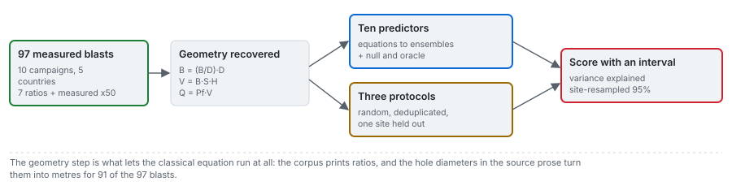

# Fragmenta documentation

Fragmenta predicts the mean fragment size x50 of a bench blast from its design and its rock, with
ten published predictors from the 1973 classical equation to the 2025 stacking ensemble, and measures
what each prediction is worth at a mine the model has not seen. This wiki explains the problem, every
predictor, how the numbers are produced and checked, the data and their contract, the tools the
product is built on, and how to use them on other data.

## What it is

- A test bench over 97 published bench blasts from ten campaigns in five countries, with two
  published hold-outs (14 blasts) and five field blasts outside the corpus envelope.
- Ten predictors in four families: the classical mean size (with two routes to its rock factor),
  the published router and regressions, six learned models, and two controls (a null and an oracle).
- Three evaluation protocols on the same rows: 100 random 80/20 draws, 100 draws after collapsing
  repeated input vectors, and ten whole-campaign hold-outs with a site-resampled interval.
- A web application with a workbench for one selected case, where the closed forms and the fitted
  models recompute live as a design changes, and five documentation pages that read every number from
  the committed artifacts.

## What it is not

- Not a mechanistic simulator. No discrete-element, grain-based or hybrid stress model of rock
  breakage is implemented; no engine or reference output for one was available.
- Not a production design tool. With ten sites, no arm that was not fitted on the corpus itself has
  a site-resampled interval above zero (see [the verdict](results/01_verdict.md)), so no predictor
  here is validated for a new mine.
- Not a model of non-ideal detonation, initiation timing, flyrock, ground vibration or downstream
  comminution. The initiation sequence is drawn on the bench view and enters no prediction.
- Not a source of validated passing curves. No dataset available for this work carries a measured
  curve, so the curve shapes are presented as models, not as validated predictions.

## The result, in one paragraph

<!-- facts:verdict -->
Over every blast (97), the best learned arm held out by site is gradient boosting at -0.034 (-2.23 to 0.42), and the criterion is not met. Over the 91 blasts with resolvable geometry it is stacking ensemble at 0.034 (-1.81 to 0.54), 0.266 above the null, and the criterion is met. The null's held-out predictions correlate with the measurements at -0.79.
<!-- /facts -->

The kill criterion was first written before the first run as a margin over the null; its positivity
half was added after that run, which had declared success for an arm worse than a constant, and the
sentence has been fixed and test-pinned since. Whether the learned tier meets it depends on whether
the six Miami blasts, which have no recoverable geometry, are scored. The
classical equation explains about 0.30 of the variance under every protocol, including with its
rock factor predicted from the modulus by a line fitted on the other sites. Published random-split
figures sit high among reproductions of their own protocol; the details are in
[protocol sensitivity](results/03_protocol-sensitivity.md). The paragraph above is filled from the
committed benchmark by `scripts/build_docs_results.py`, so it moves with the bake.

## The wiki

| Theme | Contents |
|---|---|
| [Methods](methods.md) | the problem and every predictor, term by term, from its primary source: classical mean size, rock factor, distribution shapes, router and regressions, the network, kernels and ensembles |
| [Protocols](protocols.md) | the metrics, the three split protocols and the controls, the site-resampled intervals, the criterion and the two row sets |
| [Data](data.md) | the corpus, the hold-outs and field blasts, the geometry reconstruction, and the data contract (fields, units, ranges, outliers, missing values) |
| [Relevance](relevance.md) | why each predictor is in the ladder, the decision it informs, and the evidence for it on this corpus |
| [Results](results.md) | generated from the benchmark artifact: the verdict, every arm, protocol sensitivity, per site, published reproductions, diagnostics |
| [Architecture](architecture.md) | the repositories and lanes, the bake, the two contracts, the live lanes, the portable models, the deploy |
| [Frameworks](frameworks.md) | each library the product runs on: installation, how it is used here, how to apply it to other data |
| [Cases](cases.md) | the sixteen cases, why each one is in the matrix, and the four controls |
| [Guides](guides.md) | running the bake, bringing your own blasts, reading a number, designing a blast on the response surface, regenerating the docs and drawings |
| [Design](design/SDD.md) | the software design document (ADR-0075): problem and non-goals, contracts, lanes, ladder, cases, oracles, deploy driver, risks, ADR fit; every requirement in `design/features/` names the test or gate that holds it |

## How this wiki stays true

- Numbers that move with a bake are never typed. The [results](results.md) pages and every
  `<!-- facts:... -->` block in a hand-written page are rendered from `data/derived/benchmark.json`
  by `scripts/build_docs_results.py`, and a test runs it in check mode, so a stale number fails the
  suite.
- The architecture drawings (`assets/arch-*.svg`) are generated from the committed artifacts by
  `scripts/build_architecture_svgs.py`, also checked by a test.
- The method figures (`assets/fig-*.svg`) are exported from the rendered pages by
  `frontend/gates/export-figures.mjs`, so the wiki and the site show the same drawing.
- Equations, sources and caveats are transcribed from the held papers; every DOI was resolved against
  Crossref on 2026-10-04.

## Where the science lives

The models, corpora, protocols, metrics, diagnostics and the portable model export live in
[blastfrag](https://github.com/fsantibanezleal/CAOS_BlastFrag), a separately published package
(`pip install blastfrag`) that this product pins exactly and consumes. Its own `docs/` derives each
model from its source. This repository holds the product: the case matrix, the staged bake, the two
data contracts, the artifacts, the web application and this wiki.
