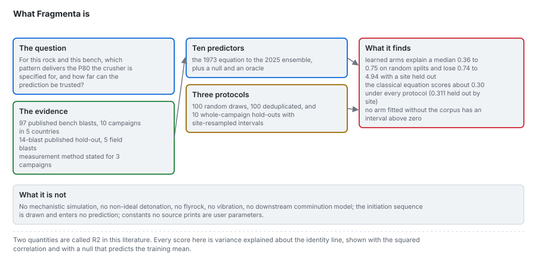
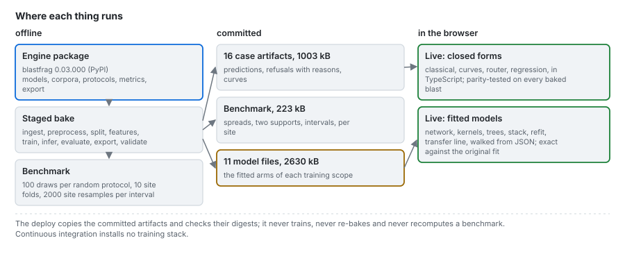
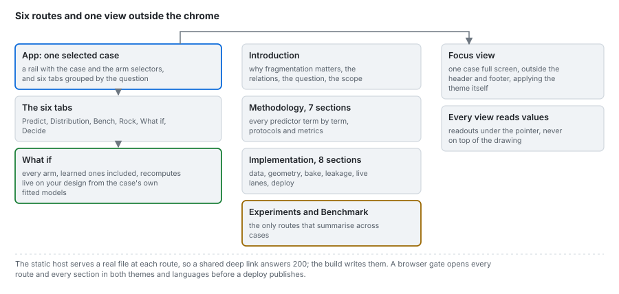

# Architecture

Two repositories, four lanes, two data contracts, and a deploy that only verifies and publishes.

| | Page | Contents |
|---|---|---|
| 1 | [The bake](architecture/01_the-bake.md) | the stages, the models and benchmark builds, determinism within and across environments, the leakage assertion, the release gate |
| 2 | [The two data contracts](architecture/02_data-contracts.md) | where each contract sits in the system; the field-level contract is in [data/04](data/04_data-contract.md) |
| 3 | [The lanes](architecture/03_lanes.md) | offline, replay, live equations, live fitted models; what holds each to the bake |
| 4 | [Deploy](architecture/04_deploy.md) | GitHub Pages, the deploy workflow, CI under ADR-0074, the custom domain, deep links |
| 5 | [Portable models](architecture/05_portable-models.md) | how a fitted forest, booster, network or kernel runs in a browser exactly |

## The two repositories

| Repository | Holds | Published as |
|---|---|---|
| [CAOS_BlastFrag](https://github.com/fsantibanezleal/CAOS_BlastFrag) | the models, the corpora and their integrity gate, the geometry reconstruction, the protocols, the metrics, the diagnostics, the portable export | the `blastfrag` package on PyPI, pinned exactly here |
| [CAOS_Fragmenta](https://github.com/fsantibanezleal/CAOS_Fragmenta) (this one) | the case matrix, the staged bake, the two data contracts, the committed artifacts, the web application, this wiki | the site at fragmenta.fasl-work.com |

A product declares no package of its own: anything a third party could use to predict fragmentation
without caring about this application belongs in the engine, where it is versioned, tested and
documented on its own.

## The lanes

## The web flow

