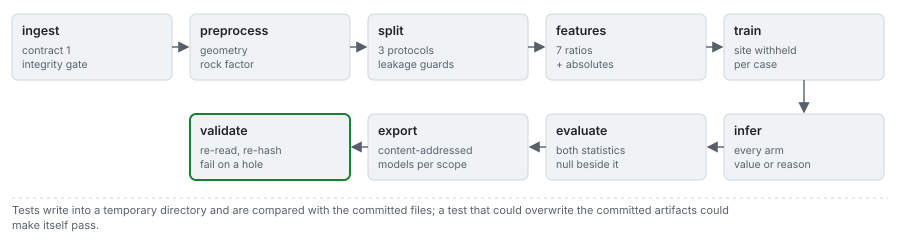

# The bake

One runner bakes every case through nine stages, writes each training scope's fitted models, builds the
cross-case benchmark, writes the index, and runs the release gate over everything it wrote.

```bash
python data-pipeline/run.py             # bake all 16 cases, the models and the benchmark
python data-pipeline/run.py --validate  # re-run the release gate on what is on disk
```



---

## 1. Why the bake is separate from the deploy

The bake produces the scientific evidence: every prediction, score, interval and fitted model the site
shows. It runs deliberately, against pinned versions, on a developer machine, and its output is
committed. The deploy verifies that committed output and publishes it; it never trains or recomputes a
benchmark (ADR-0074), so a release always has a reproducible artifact behind it and the numbers do not
depend on which runner picked up a job.

## 2. The stages of a case

| Stage | What it does | What it refuses |
|---|---|---|
| `ingest` | loads the case's blasts through the engine's contract, records provenance and flags | a row outside the contract bounds; an out-of-envelope row unless the case opts in |
| `preprocess` | recovers the absolute pattern, resolves the rock factor, re-asserts the source's dimensional constraints | reconstructing without checking |
| `dataset` | builds the training rows for the case: the corpus minus the case's own campaign for a real case | a training set that contains a blast of the case |
| `feature_extraction` | the seven ratios plus the derived absolutes; each arm keeps its own normalisation | unifying normalisations that are not interchangeable |
| `train` | fits every learned arm and the transfer line on those training rows | training on everything and showing the result as a prediction |
| `infer` | every arm over every blast and every design variant, each cell a number or an abstention with its reason | a number where the model cannot answer |
| `evaluate` | variance explained and correlation, the null beside every arm, the case's controls | a statistic under a bare label |
| `export` | the content-addressed case artifact and manifest; the case's models file (stage `models`) | `NaN` or `Infinity`, which no browser can parse |
| `validate` | re-reads, re-hashes and re-checks what was written | passing without reading what was written |

The `models` stage (`stages/models.py`) runs inside the bake of each case: it exports the fitted arms
of that case's training scope through the engine's portable export, with fixtures of the original
models' predictions at the 116 shipped blasts ([05](05_portable-models.md)). Cases that share a scope
share one file; the eleven scopes are the ten campaigns withheld one at a time, and the whole corpus.

## 3. The benchmark build

After the cases, `stages/benchmark.py` runs the engine's benchmark on the corpus: 100 random draws, 100
deduplicated draws, the ten-fold leave-one-site-out with intervals from 2000 site resamples, the
verdict on both row sets, the per-site errors, the arm provenance and the diagnostics. It adds the
published reproductions (the 2010 and 2012 hold-outs, the row in both sets), the 30-seed sweep of the
published network, the per-site metadata, and the corpus, hold-out and field rows the Benchmark page
re-scores in the browser. The result is `benchmark.json` (`fragmenta.benchmark/v2`). Most of the
bake's time goes here, mostly to the network's Levenberg-Marquardt training.

## 4. Determinism, and the two claims it supports

A bake is a function of the case registry, the pinned environment (`requirements-precompute.txt`:
`blastfrag`, `numpy`, `scikit-learn` and `xgboost` pinned exactly) and the seed. That supports two
different claims, measured with two instruments.

**Within one environment, byte-identical.** Two bakes on the same machine write the same bytes, and a
test bakes one case twice into a sandbox and compares them. Four things could break this and each is
handled: dictionary ordering (keys are sorted); a wall clock in a manifest (budgets and a verdict are
recorded, not a measured runtime); a stopping rule that depends on CPU speed (the learned arms stop on
numerical criteria); and newline translation (`Path.write_text` writes CRLF on Windows, so every file
goes through one writer that fixes LF).

**Across environments, to a tolerance.** Two builds of the same pinned numpy can reduce a dot product in
a different order; the last bits differ at about 1e-16, an iterative solver amplifies that, and no pin
removes it. The cross-environment check therefore compares numbers, not hashes:

$$
\frac{|a - b|}{\max(|a|, |b|)} \le 10^{-6}\quad \text{for every number in every artifact}
$$

At version 0.04 this was measured by baking all sixteen cases on Windows and on Linux (Python 3.13,
numpy 2.5.3, scikit-learn 1.9.0, xgboost 3.4.1): the worst relative difference was 2.7e-08, on
`real-reocin-ug`; typical cases differed in 30 to 100 fields at around 1e-09; and `ctrl-degenerate`,
where every arm abstains, was byte-identical, which is the control on the explanation (a case with no
arithmetic does not drift).

At version 0.06.000 it was measured again, Windows 11 (Python 3.13.14) against Ubuntu 24.04 under WSL2
(Python 3.13.16), with the same pins and BLAS on one thread: every case and its models file reproduces.
The worst difference in a case is 2.7e-08, on `real-reocin-ug` again; typical cases differ in 30 to 110
fields; `ctrl-degenerate` has no number that differs. The models files, compared for the first time,
differ in about 1,400 to 1,600 fields each, the worst at 7.0e-07 on a network weight of magnitude
2.8e-4 that moved by 2.0e-10: a relative difference inflates near zero, so a near-zero weight is where
the tolerance is closest.

The same run found that the comparison could not pass across environments at all since 0.05.000. Each
case carries the digest of its training scope's models file, a hash that moves with the last bit of any
number in that file, and the tool compared it as a string; every case failed with every number within
tolerance. Nothing noticed, because the cross-environment run had not been repeated since 0.04. The tool
now skips the two digests computed over numbers and compares the numbers they cover, the case's and its
models file's; the corpus digest, a hash of the input, is still compared exactly, and a test holds that
split.

```bash
python scripts/compare_bakes.py                           # every case against the committed artifacts
python scripts/compare_bakes.py real-murgul --repeat 2    # byte identity within this environment
```

Both bake into a sandbox, never the canonical tree, so a check cannot overwrite the artifacts it is
checking. Under ADR-0074 they run on a developer machine before a release, not in CI.

## 5. The leakage assertion

For a real campaign, the learned arms are fitted on the corpus minus that campaign. The bake asserts
that none of the case's blasts appear in its training rows and that the withheld site is absent, stamps
the withheld site on the artifact (`held_out_site`), and points the case at the models file of that
scope. A violation stops the bake.

For a synthetic case or the field set, nothing is withheld, because those blasts are not in the corpus;
the artifact says so in words rather than leaving the field empty.

The assertion does not make campaigns independent: the two Reocin campaigns share a rock (45 GPa) and
information no protocol can remove.

## 6. The release gate

`validate` re-reads every artifact from disk and checks the content digests (file and index) of every
case, the benchmark and every models file; the corpus digest against the installed engine; that no
artifact contains `NaN` or `Infinity`; that each real case's withheld site is its own; that every
control passed; that every abstention has a reason; and that each case points at its own scope's models
file. The full list is in [data/04](../data/04_data-contract.md). One failure fails the bake.

## 7. What the bake produces

| | Count | Size |
|---|---|---|
| case artifacts | 16 | about 1.0 MB in all |
| manifests | 16 plus the index | small |
| benchmark | 1 | about 229 kB |
| models files | 11 | about 2.7 MB in all, about 240 kB each |

The cases carry 1976 prediction cells, 294 of them abstentions, each with its reason.
