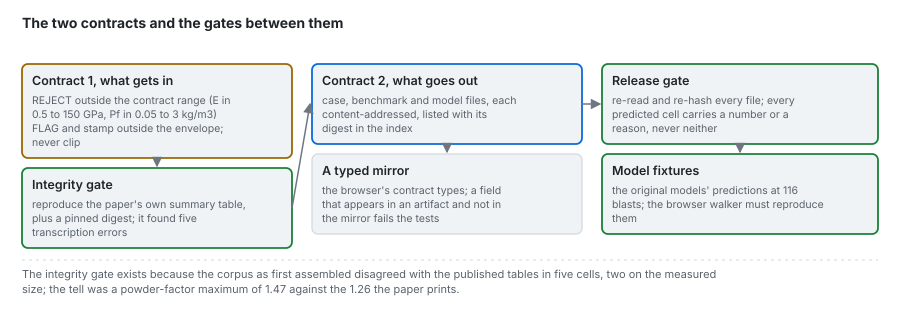

# The two data contracts

Where the contracts sit in the system. The field-level contract (fields, units, bounds, envelope,
missing values, outliers, artifact schemas, release-gate checks) is in
[data/04](../data/04_data-contract.md); this page is about the boundaries.



---

## 1. Contract 1 is the engine's

The ingestion contract lives in `blastfrag`, not here: `validate_blast`, `CONTRACT_BOUNDS`,
`TRAINING_ENVELOPE` and the integrity gate on the corpus. The bounds are properties of the published
corpus, and keeping them next to the models means a model and its admissible inputs are versioned
together. This product calls the contract at `ingest` and never relaxes it; a case that wants
out-of-envelope rows (the field set) opts in explicitly, and its predictions are stamped.

## 2. Contract 2 is this product's

The artifacts are this product's interface between the bake (Python) and the web (TypeScript):

```
bake (Python)  ──writes──>  data/derived/**  ──copied at build──>  frontend/public/data/**  ──fetched──>  browser
                              digests in the index                    presence checked                    typed mirror
```

Three places hold it:

1. **The writer** (`data-pipeline/pipeline/core/jsonio.py`, `stages/export.py`, `stages/models.py`,
   `stages/benchmark.py`): sorted keys, LF endings, no non-finite floats, a content digest in every file.
2. **The typed mirror** (`frontend/src/lib/contract.types.ts`): every field the artifacts carry, with
   the schema names `fragmenta.case/v1`, `fragmenta.benchmark/v2` and `fragmenta.models/v1`. The
   parity test reads the committed artifacts and fails when a field appears on one side only, so a
   renamed field fails the build instead of rendering an empty chart.
3. **The checks**: the release gate (`stages/validate.py`, also run by the deploy through
   `scripts/check_artifacts.py`) and the build's copy step (`frontend/copy-data.mjs`), which fails if a
   case or a models file the index declares did not ship.

## 3. Why the integrity gate sits behind contract 1

Contract 1 checks that each value could be a blast; it cannot tell a wrong digit from a right one. The
integrity gate compares the whole table with the source's own summary statistics and a pinned digest,
which is how five transcription defects were found ([data/01](../data/01_corpus.md)). The two answer
different questions: the statistics say the file is the published table, the digest says it has not
moved since it was corrected.
