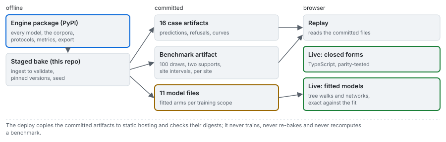

# The lanes

Four lanes, each with the check that holds it to the bake.

| Lane | What runs | What holds it to the bake |
|---|---|---|
| offline | training, the per-case bake, the 100-draw protocols, the site hold-outs, the intervals, the diagnostics, the seed sweep | pinned versions, a seed, the release gate |
| replay | the case, benchmark and models files, read by the web | a content digest per file, checked by the release gate and the deploy |
| live: equations | the closed forms, rewritten in TypeScript | a parity test against every baked blast |
| live: fitted models | the learned arms, walked from their exported form | fixtures of the original models' predictions |

---

## 1. Offline is canonical

Everything that fits or measures runs before release, in the pinned Python environment, against the
published engine ([01](01_the-bake.md)). Nothing in this lane runs at deploy time or in a browser.

## 2. Replay is the default evidence

The web reads the committed artifacts and computes nothing from raw data. Every number on the
documentation pages is read from `benchmark.json` or a case file through `frontend/src/lib/facts.ts`,
never typed into the page, and every one of those files carries a digest the gate checked.

## 3. Live: the equations

The closed forms are rewritten in TypeScript (`frontend/src/engine/live.ts`) so that changing a design
moves the curve without a server: the classical mean size, the uniformity index, the Rosin-Rammler and
Swebrec curves and the crush-zone composition, the discriminant router, the two published power laws,
and the guard that refuses a design whose stemming swallows the bench.

**Parity is a test.** `frontend/test/parity.test.ts` scores the TypeScript against the baked numbers
point for point on every blast of every case: the mean size, the regression, the router, both curves
across the size grid, the reconstruction and the refusals. The criterion is the artifacts' own rounding:

$$
\left|\,x_{50}^{\mathrm{TS}} - x_{50}^{\mathrm{py}}\right| < 5\times 10^{-4}\ \mathrm{m}
$$

A divergence fails the build. A design built with the App's controls has no baked number to compare
with; what holds it is that the same functions passed parity on every baked blast.

**One trap the test is aimed at.** The uniformity index's leading term is $2.2 - 14B/d$ with the burden
in metres and the diameter in millimetres. Read as the tabulated burden-to-diameter ratio, which is a
thousand times larger, the term becomes about $-380$. The test asserts the index lands in a physical
band on every real blast, and that the degenerate control, which has no charge column, returns exactly
zero.

## 4. Live: the fitted models

The learned arms are fitted offline with scikit-learn and XGBoost, which a browser does not have, and
ONNX Runtime Web has no tree-ensemble kernel. So the engine exports each fitted model as plain JSON and
`frontend/src/engine/learned.ts` walks it. The Design group uses the models file of the open case's
training scope, so a learned number shown for a campaign comes from a model fitted without it, and the
Benchmark page's live check walks the whole-corpus models over the published hold-out. How the walk is
made exact is in [05](05_portable-models.md).

## 5. The lane gate

Which lane a case runs in is recorded in its manifest's `gate` block with the numbers behind it, not
chosen by hand: the case's trace size against a 256 kB budget, whether what it runs is pure Python
with numpy as its only wheel, the run-time budget, the verdict and the reasons for it. The manifest
records budgets rather than a measured runtime, because a wall-clock number would make two identical
bakes differ. Every case in this product comes out live.
