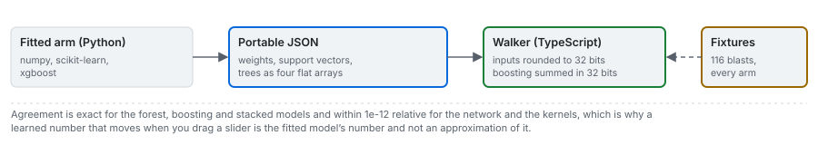

# Portable models

How a forest, a booster, a network or a kernel fitted with numpy, scikit-learn and XGBoost runs in a
browser, and why its numbers are the fitted model's and not an approximation of them.



---

## 1. Why a custom format

The learned arms are fitted offline with libraries a browser does not have. ONNX Runtime Web, the usual
route, has no tree-ensemble kernel, and a forest of 76 trees is most of what needs to run. So the engine
exports each fitted arm as plain JSON (`blastfrag.portable/v1`, `bf.export_arm`) and this product's
TypeScript walker (`frontend/src/engine/learned.ts`) evaluates it.

## 2. The models file

One file per training scope, `data/derived/models/<scope>.json`, schema `fragmenta.models/v1`:

| Field | Meaning |
|---|---|
| `scope` | the withheld campaign, or `corpus` for the whole corpus |
| `held_out_site`, `n_training_rows` | what the arms were fitted on |
| `arms` | one portable document per live arm |
| `fixtures` | the original fitted models' predictions at the 116 shipped blasts (97 corpus, 14 hold-out, 5 field), at full precision |
| `engine`, `app_version`, `digest` | provenance and the content address |

The live arms are the published network, the radial support-vector arm, the random forest, gradient
boosting, the stacked model, the refitted power law and the transfer line. The polynomial kernel is
left out by choice: the Design group shows one kernel model, and the radial one is the better of the two
under every protocol. The stacked model's forest and booster are stored as references
(`{"ref": "random-forest"}`) to the standalone arms, after the stage asserts that the trees are
identical, which keeps each file at about 240 kB.

## 3. The document, by kind

| Kind | What is stored | How it is evaluated |
|---|---|---|
| `network` | the router; per group the input bounds, the target range, the hidden width and eight weight vectors ($W_1$ row-major, $b_1$, $W_2$, $b_2$) | min-max scale, logistic hidden layer, linear output, clamp to $[0, 1]$, rescale, average the eight |
| `svr` | standardisation, kernel, $\gamma$, degree, $c_0$, support vectors, dual coefficients, intercept | $\hat y = \sum_i \alpha_i K(\mathbf s_i, \mathbf z) + b$ |
| `forest` | standardisation; every tree as four arrays `left`, `right`, `feature`, `t` | walk left when the input is at most `t`; a leaf when `left` is -1; mean over trees |
| `xgboost` | the same arrays, `t` a 32-bit split or leaf value; `base_score` | walk left when the input is strictly below `t`; base score plus leaves |
| `stacking` | the forest, the booster and the meta-learner's weights and intercept | $w_F\,\hat y_{\mathrm{RF}} + w_B\,\hat y_{\mathrm{XGB}} + c$ |
| `power-law` | the router; per group the intercept and seven exponents | $c_g \prod_j z_j^{\beta_{g,j}}$ |
| `kuznetsov-transfer` | the fitted line $\ln A = a + b \ln E$ | returns the rock factor; the browser's classical equation does the rest |

## 4. Matching the libraries to the last bit

Three details decide whether a port agrees exactly:

1. **Inputs are rounded to 32 bits before every tree comparison.** scikit-learn casts inputs to 32-bit
   floats before comparing them with its thresholds; XGBoost compares 32-bit inputs with 32-bit split
   values. In the browser that is `Math.fround`.
2. **XGBoost's split values are rounded back to 32 bits.** Its JSON prints each value as a short decimal
   that parses to a nearby 64-bit float; without rounding back, 3 of 100 trees took the other branch on
   one blast where an input equalled a split value.
3. **XGBoost's leaf sum is accumulated in 32 bits**, starting from the base score.

$$
z_j^{(32)} = \mathrm{fl}_{32}\!\left(\frac{x_j - \mu_j}{\sigma_j}\right),\qquad
s_k = \mathrm{fl}_{32}\big(s_{k-1} + \ell_k(z^{(32)})\big),\quad s_0 = \mathrm{fl}_{32}(b_0)
$$

## 5. What the tests hold

`frontend/test/learned.test.ts` loads every committed models file and compares the walker with the
fixtures at all 116 blasts: the forest, the booster and the stack exactly, and the network, the kernel
and the power law to a relative difference below $10^{-12}$ (they call an exponential or a power, and
the last bits of those differ between libraries); more than 8000 fixtures are checked. Abstentions must
agree too, including the refusal of a design whose output leaves the plausible range. A second test
checks that every learned prediction a case artifact replays is what that case's models file returns,
so the replayed and the live numbers cannot come from two different fits. The engine's own tests
assert the same agreement for its Python reference walker.

A live learned number is therefore the fitted model's number. It is no more reliable outside the
training envelope than the benchmark says the model is.

## 6. Using the export on your own fit

```python
import json
import blastfrag as bf

train = bf.load_training_corpus()
arm = bf.default_arms()["random-forest"]().fit(train)
document = bf.export_arm(arm)
json.dump(document, open("forest.json", "w"))

value, reason = bf.predict_portable(document, train[0])   # metres, or None and the reason
```

The runnable version is [frameworks/01_blastfrag/example.py](../frameworks/01_blastfrag/example.py).

## Sources

- Breiman, L. (2001). Random forests. *Machine Learning* 45:5-32. [doi:10.1023/A:1010933404324](https://doi.org/10.1023/A:1010933404324)
- Chen, T. and Guestrin, C. (2016). XGBoost. *Proc. 22nd ACM SIGKDD*, 785-794. [doi:10.1145/2939672.2939785](https://doi.org/10.1145/2939672.2939785)
- Smola, A. J. and Schölkopf, B. (2004). *Statistics and Computing* 14:199-222. [doi:10.1023/B:STCO.0000035301.49549.88](https://doi.org/10.1023/B:STCO.0000035301.49549.88)
- Engine: [blastfrag docs/data/03_portable-export.md](https://github.com/fsantibanezleal/CAOS_BlastFrag/blob/main/docs/data/03_portable-export.md)
