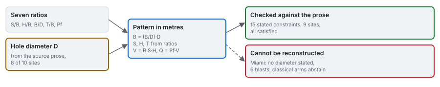

# Recovering the geometry

The corpus records seven ratios and no dimension; the classical equation needs a rock volume and a
charge mass per hole. A hole diameter closes the system, the source's prose gives one for eight of ten
campaigns, and fifteen dimensional constraints in the same prose check the result.

---

## 1. The arithmetic

With the diameter $D$ in metres:

$$
B = \tfrac{B}{D}\,D,\quad S = \tfrac{S}{B}\,B,\quad H = \tfrac{H}{B}\,B,\quad T = \tfrac{T}{B}\,B,\qquad
V = B\,S\,H,\quad Q = P_f\,V,\quad L = \max(0,\ H + J - T)
$$

$V$ is the rock volume and $Q$ the explosive mass per hole; $L$ is the charge length, with no subdrill
$J$ published. The powder factor is carried as a field rather than derived from a charge geometry,
because the corpus publishes it and does not publish the charge geometry.

## 2. Where the diameters come from

Section 3 of Hudaverdi et al. (2010) describes each campaign in prose:

| Campaign | Diameter | The sentence in the source |
|---|---|---|
| Enusa | 165 mm | "Hole diameters for the Enusa and Reocin mines were 165 and 229 mm" |
| Reocin | 229 mm | the same sentence |
| Murgul | 165 mm | "The drillhole diameter applied was 165 mm" |
| Mrica | 76 mm | "The hole diameter was 76 mm and bench height was 10 to 15 m" |
| Soma | 210 mm | "The diameter of the blast holes was 21 cm" |
| Dongri-Buzurg | 100 mm | "The hole diameter was 100 mm and bench height was 6 to 11 m" |
| Akdaglar | 89 mm | "The drillhole diameter is 89 mm" |
| Ozmert | 89 mm | "The hole diameter is 89 mm" |

**The ninth, derived.** Reocin underground states no diameter but an 18 m bench height. Inverting the
chain,

$$
D = \frac{H}{(H/B)\,(B/D)},
$$

returns 91.2 mm on all six of its rows, from two different bench-height ratios (5.00 on one row, 6.00 on
five) and two different burden-diameter ratios (39.47 and 32.89): a six-fold internal check rather than
an assumption.

**The tenth, not reconstructed.** Miami publishes no diameter and no absolute dimension. Its six rows
are not reconstructed, the engine raises rather than returning a pattern, and every arm that needs a
volume abstains there with the reason. This is the campaign that separates the two row sets of the
benchmark ([protocols/04](../protocols/04_criterion-and-row-sets.md)).

## 3. The check: fifteen constraints

The same prose also states dimensions, and the reconstruction is asserted against every one: fifteen
constraints at nine campaigns, all satisfied.

| Campaign | The source states | The reconstruction gives |
|---|---|---|
| Enusa | bench 6 m | 5.984 m |
| Reocin | bench 9 to 11 m | 9.00 to 11.76 m |
| Reocin-UG | bench 18 m | 17.997 to 17.998 m |
| Murgul | bench 12 m, burden 4.5 to 5 m, spacing 4.5 to 5.5 m | 12.00 m, 4.50 to 5.00 m, 4.50 to 5.50 m |
| Mrica | bench 10 to 15 m | 15.00 m |
| Soma | spacing 7.5 m, bench 15 m | 7.50 m, 15.00 m |
| Dongri-Buzurg | bench 6 to 11 m, burden 2 to 2.5 m, spacing 1.8 to 3.5 m | 6.00 to 11.00 m, 2.00 to 2.50 m, 2.50 to 3.50 m |
| Akdaglar | burden mean 2.17 m, sd 0.35 m | mean 2.07 m, sd 0.33 m |
| Ozmert | burden 2.5 m, spacing 3 m | 2.00 to 3.00 m, 2.50 to 3.00 m |

Murgul is the strongest check: one paragraph states three independent quantities and one rule
reproduces all three exactly. Dongri-Buzurg adds three more.

**The tolerance is derived, not chosen.** The corpus prints every ratio to two decimals, so each ratio
carries half a unit of the last digit, and the reconstruction inherits it through the multiplication:
burden from one ratio, spacing and bench height from two, with relative uncertainties adding over a
product:

$$
\frac{\delta(xy)}{xy} \approx \frac{\delta x}{x} + \frac{\delta y}{y},\qquad \delta x = 0.005
$$

That is why Enusa's 5.984 m passes against a stated 6 m, and why a ten percent change in a diameter
fails.

## 4. Soma's conflict, carried

Soma's paragraph states both a 5 m burden and a 21 cm diameter, and its burden-diameter ratio (28.57)
cannot hold both (5 / 0.21 = 23.8). Taking the diameter gives a 6.00 m burden that reproduces the stated
7.5 m spacing and 15 m bench exactly; a 175 mm diameter with a 5 m burden satisfies the ratio and then
fails the bench height. Two of three constraints select the diameter, so it is used, the burden
constraint is not asserted, and the conflict travels with the Soma case. Which figure the authors
intended is recorded as unresolved.

## 5. Independent evidence

- **The field set** publishes its absolute pattern and its ratios; the reconstruction on its ratios
  agrees with its published burden, spacing, bench height and stemming to the printed precision (an
  engine test).
- **The rock factor.** Back-solved from the published classical predictions with this geometry, the
  factor barely varies within each site ([methods/03](../methods/03_rock-factor.md)); an error in the
  burden or the bench height would scatter it.

## 6. In the application

The **Bench** tab of the App draws the selected blast's reconstructed bench in three dimensions from the
artifact's pattern, with an initiation sequence (tie-in and inter-hole delay) that is animated and, as
[methods/04](../methods/04_distribution-shapes.md) section 6 says, enters no prediction. Beside it, a
panel lists each constraint the source states for that campaign against the reconstructed value. For
Miami the tab shows the reason there is no bench to draw.

## Sources

- Hudaverdi, T., Kulatilake, P. H. S. W. and Kuzu, C. (2010). *Int. J. Numer. Anal. Methods Geomech.* 35:1318-1333. [doi:10.1002/nag.957](https://doi.org/10.1002/nag.957)
- Sui, Y. et al. (2025). *Applied Sciences* 15:1254. [doi:10.3390/app15031254](https://doi.org/10.3390/app15031254)
- Engine: [blastfrag docs/data/02_geometry-reconstruction.md](https://github.com/fsantibanezleal/CAOS_BlastFrag/blob/main/docs/data/02_geometry-reconstruction.md)
