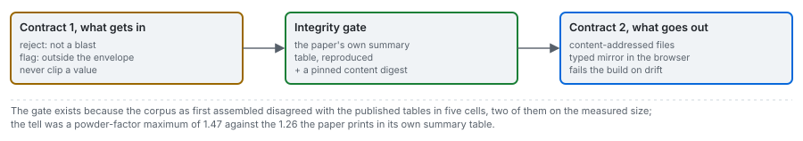

# The data contract

Two contracts. Contract 1 decides what a row must be to get in, and what happens to a row outside the
data. Contract 2 decides what the web reads: the artifacts, their fields, and the checks that stand
between a bake and a release.

---

## Contract 1: a row

### Fields and units

A blast is the seven inputs, optionally the measured size, and its identity. The bounds live in the
engine (`blastfrag.datasets.CONTRACT_BOUNDS`, `TRAINING_ENVELOPE`, `X50_BOUNDS`), because they are
properties of the published corpus and a model and its admissible inputs should not drift apart.

| Field | Unit | Rejected outside (contract bounds) | Extrapolation outside (training envelope) |
|---|---|---|---|
| `S_over_B` | ratio | 0.5 to 3.0 | 1.00 to 1.75 |
| `H_over_B` | ratio | 0.5 to 15.0 | 1.33 to 6.82 |
| `B_over_D` | ratio | 5.0 to 80.0 | 17.98 to 39.47 |
| `T_over_B` | ratio | 0.1 to 8.0 | 0.50 to 4.67 |
| `Pf_kg_m3` | kg/m3 | 0.05 to 3.0 | 0.22 to 1.26 |
| `XB_m` | m | 0.005 to 10.0 | 0.02 to 2.35 |
| `E_GPa` | GPa | 0.5 to 150.0 | 9.57 to 60.0 |
| `x50_m` (optional) | m | 0.001 to 5.0 | |
| `blast_id`, `site` | text | required | |

The classical arms also need an absolute pattern: burden, spacing, bench height and stemming in metres,
the hole diameter in millimetres, the powder factor, and optionally the subdrill and the explosive's
relative weight strength (ANFO, 100, by default). For the corpus it is recovered
([data/03](03_geometry.md)); for your own blasts you supply it.

### Two bands, deliberately different

- **Outside the contract bounds is an error, and it is rejected.** A Young modulus of 60000 is a unit
  error (MPa entered as GPa), not an unusual rock. The engine raises `ContractViolation` with the field,
  the value and the bounds.
- **Outside the training envelope is an extrapolation, and it is refused by default.** It is admitted
  only with `allow_extrapolation=True`, and every prediction made on such a row carries the
  `extrapolated` stamp and the list of fields outside. In the App, the Predict chart draws extrapolated
  points in their own colour and badges them in its readout, and the What if tab marks each control
  that leaves the envelope and says so under the chart.

### Nothing is clipped

A clipped input produces a confident prediction for a design nobody entered, and it looks the same as
a prediction for one that was. No input is clipped anywhere in the engine or in this product. Outputs
are bounded only in the sense that an arm whose prediction leaves the plausible size range (0.001 to
3 m) abstains with the value in its reason.

### Missing values

- **A missing input is rejected, never imputed.** A non-finite value fails the bounds check and raises.
  Imputing an input from the corpus would make a prediction look evidenced when part of it was guessed.
- **A missing measurement is allowed.** A row with no `x50_m` is a design: every arm predicts it and
  nothing scores it. The synthetic cases and every design variant are such rows.
- **A missing pattern** makes the classical arms abstain, with the reason; the arms that use only the
  ratios still answer. That is the Miami campaign's situation.
- **A missing rock property** makes a rock-factor scheme raise rather than assume it
  ([methods/03](../methods/03_rock-factor.md)).

### Outliers

An outlier is not removed. The diagnostics run an Isolation Forest (Liu, Ting and Zhou 2008) on the
seven inputs and the logarithm of the measured size, standardised, with the contamination set to the
share a 2025 study flagged on a 105-row superset of this corpus (5 of 105), and report the flagged
rows by site ([results/06](../results/06_diagnostics.md)). The screen is reported, never applied as a
filter: a blast that is unusual within ten campaigns is the kind of blast a model will meet at an
eleventh, and dropping it would flatter every score.

### The integrity gate

Behind contract 1, loading the corpus reproduces the source's own summary table and compares a pinned
content digest ([data/01](01_corpus.md) section 5).

---

## Contract 2: what the web reads

### The artifacts

| File | Schema | One per | What it holds |
|---|---|---|---|
| `data/derived/<case>/case.json` | `fragmenta.case/v1` | case (16) | the case's blasts and patterns, every arm's prediction or abstention with its reason, the case's scores, distributions, variants, controls, provenance, and which models file it runs live |
| `data/derived/benchmark.json` | `fragmenta.benchmark/v2` | release | the three protocols with draws, spreads, pooled scores on two row sets and site-resampled intervals; per-site errors; the verdict; arm provenance; diagnostics; the published reproductions and seed sweep; the corpus, hold-out and field rows |
| `data/derived/models/<scope>.json` | `fragmenta.models/v1` (arms in `blastfrag.portable/v1`) | training scope (11) | the fitted learned arms, exported, and fixtures of the original models' predictions at the 116 shipped blasts |
| `data/derived/manifests/<case>.json` | | case | the case's lane measurement and budgets |
| `data/derived/manifests/index.json` | | release | every case, the benchmark and every models file, each with its path, byte size and digest; the app and engine versions; the corpus digest |

### Rules every artifact follows

- **Content-addressed.** Each file stores the SHA-256 of its canonical serialisation (keys sorted),
  computed without the digest field, and the index repeats it:
  $d = \mathrm{SHA256}(\mathrm{json}_{\mathrm{sorted}}(\text{payload}))$.
- **Every predicted cell carries a number or a reason.** An abstention without a reason fails the
  bake.
- **No non-finite floats.** Python writes `NaN` and `Infinity` into JSON, neither is valid JSON, and a
  browser throws on the first one. The export converts them to `null`, the writer refuses to emit
  them (`allow_nan=False`), and the release gate searches the written text for the three tokens.
- **One writer, LF line endings**, so a bake on Windows and on Linux writes the same bytes for the
  same numbers.
- **A typed mirror.** `frontend/src/lib/contract.types.ts` names every field the artifacts carry, and
  a test fails when a field appears on one side only.

### The release gate

`python data-pipeline/run.py --validate` (and `scripts/check_artifacts.py`, which the deploy runs)
re-reads every artifact from disk (cases, benchmark and models files) and checks: each content digest
against the file's own and the index's; the corpus digest against the installed engine; no `NaN` or `Infinity` in the text; that the
withheld site of each real case is that case's own site; that every control passed; that every
abstention has a reason; that every models file matches its index entry; and that each case points at
the models file of its own training scope. Any failure stops the release.

## Sources

- Liu, F. T., Ting, K. M. and Zhou, Z.-H. (2008). Isolation forest. *Eighth IEEE International Conference on Data Mining*, 413-422. [doi:10.1109/ICDM.2008.17](https://doi.org/10.1109/ICDM.2008.17)
- Huan, B. et al. (2025). *Scientific Reports*. [doi:10.1038/s41598-025-96005-7](https://doi.org/10.1038/s41598-025-96005-7) (the 5 of 105 contamination)
