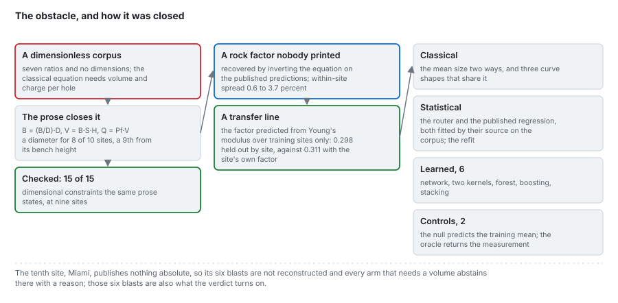

# Methods

Ten predictors of the mean fragment size in four families, each transcribed from its primary source
with every symbol defined, what this product sets where the source is silent, and where each one
fails on this corpus. Read in order; each page ends with its evidence, rendered from the committed
benchmark, and its sources.

| | Page | Predictors (arm ids) |
|---|---|---|
| 1 | [The problem](methods/01_the-problem.md) | what is predicted, from what, and why grouped rows change the question |
| 2 | [Classical mean size](methods/02_classical-mean-size.md) | `kuznetsov`, and its transfer route `kuznetsov-transfer` |
| 3 | [The rock factor](methods/03_rock-factor.md) | the five routes to A, the recovery from published predictions, the transfer line |
| 4 | [Distribution shapes](methods/04_distribution-shapes.md) | Rosin-Rammler with Cunningham's index, Swebrec, the crush-zone composition |
| 5 | [Router and regressions](methods/05_router-and-regressions.md) | `group-discriminant`, `published-regression`, `refitted-regression` |
| 6 | [The published network](methods/06_neural-network.md) | `published-neural-net` |
| 7 | [Kernels, forests, boosting, stacking](methods/07_kernels-and-ensembles.md) | `svr-rbf`, `svr-poly`, `random-forest`, `xgboost`, `stacking` |

The two controls, `null` (predict the training mean) and `oracle` (return the measurement), are
defined with the protocols in [protocols/02](protocols/02_three-protocols.md), because they measure
the protocol rather than the blast.

## The four families at a glance

| Family | What it uses | Fitted on | Live in the browser |
|---|---|---|---|
| Classical | the absolute pattern (V, Q), the explosive strength, a rock factor | nothing (closed form); the transfer line on training sites | TypeScript closed form, parity-tested |
| Statistical | the seven ratios | by its source, on these 97 blasts (router and published regression); per split (refit) | closed forms; the refit from its exported exponents |
| Learned | the seven ratios, standardised | per split, on its training rows only | walked from the exported model, exact |
| Controls | the training mean, or the measurement | per split | not shown as predictors |

## The engine

Every model here is implemented in [blastfrag](https://github.com/fsantibanezleal/CAOS_BlastFrag),
whose `docs/methods/` derives each one in more detail. These pages describe the methods as this
product applies them, including the settings it chooses where a source is silent.
