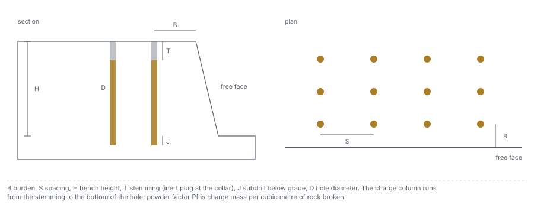

# The problem

What is predicted, from what, why it matters downstream, and why rows that come in campaigns change
what a score means.

---

## 1. Why the size of broken rock matters

Blasting is the primary means of fragmentation in mining and the first stage of size reduction.
Hudaverdi, Kulatilake and Kuzu (2010) write that blasting has a significant impact on loading,
crushing and grinding: better fragmentation raises loader and excavator productivity through greater
diggability and higher bucket and truck fill factors, and a suitable, uniform size distribution
raises crusher and mill throughput and lowers the energy spent on size reduction. The same paper
describes the mine-to-mill approach as optimising the blast for overall profitability rather than for
each operation on its own, and notes that a uniform distribution removes the need to re-blast oversize
boulders. Amoako, Jha and Zhong (2022) make the same point from the cost side: an efficient blast
saves what would be spent on secondary blasting and on the crushing and grinding that follow.

The practical question therefore has numbers in it: for this rock and this bench, which pattern
delivers the size the primary crusher is specified for, without excess fines or oversize, and how
wrong could the prediction be. This product works on the first number in that chain, the mean size
x50, and on the curve around it.

## 2. What the designer controls, and what the rock decides

Both sources divide blast parameters into controllable and uncontrollable ones. The engineer sets
the geometry (hole diameter, burden, spacing, bench height, stemming, subdrill), the explosive (type,
strength, powder factor) and the timing (delays and initiation sequence). The rock and the rock mass
are given: strength, elastic modulus, density, and the number, orientation and spacing of the
discontinuities.

## 3. What the corpus records

The corpus (Hudaverdi et al. 2010) records five design parameters as dimensionless ratios and two
rock parameters. The authors chose the rock parameters because they were the two available for the
whole database: the modulus to represent mechanical behaviour and the block size to represent the
rock-mass structure. Every blast used ANFO, so the explosive type is not a variable.

| Symbol | Field | Meaning | Unit |
|---|---|---|---|
| S/B | `S_over_B` | spacing over burden | ratio |
| H/B | `H_over_B` | bench height over burden | ratio |
| B/D | `B_over_D` | burden over hole diameter | ratio |
| T/B | `T_over_B` | stemming over burden | ratio |
| Pf | `Pf_kg_m3` | powder factor, explosive mass per rock volume | kg/m3 |
| XB | `XB_m` | in-situ block size | m |
| E | `E_GPa` | Young modulus of the rock | GPa |
| x50 | `x50_m` | measured mean fragment size, the target | m |

The corpus publishes no dimension. The classical equation needs a rock volume and an explosive mass
per hole, so applying it requires the absolute pattern, which [data/03](../data/03_geometry.md)
recovers from the ratios and the hole diameters stated in the source prose.

## 4. The symbols used across the wiki

| Symbol | Meaning |
|---|---|
| $x_{50}$ | mean size, the mesh that 50 percent of the fragments pass |
| $P_{80}$ | mesh that 80 percent pass, the figure a crusher is specified against |
| $B, S, H, T$ | burden, spacing, bench height, stemming, in metres |
| $D$ | hole diameter, in millimetres |
| $P_f$ or $K$ | powder factor, kg of explosive per m3 of rock |
| $V, Q$ | rock volume broken by one hole (m3) and the explosive mass in it (kg) |
| $A$ | rock factor, dimensionless, published valid range 0.8 to 22 |
| RWS | weight strength relative to ANFO; ANFO 100, TNT 115 |
| $E$ | Young modulus, GPa |
| $X_B$ | in-situ block size, m |
| $n$ | uniformity index of the size distribution |

## 5. The question this product asks

The classical family has been extended many times; Ouchterlony and Sanchidrián (2019) review those
extensions. Since 2012 a series of learned models has also been fitted to the same 97 blasts: a
neural network published with its full specification (Kulatilake et al. 2012), support-vector
regression (Amoako et al. 2022), forests, boosting and, in 2025, a stacked ensemble that reports 0.943
from one random 80/20 split (Sui et al. 2025).

Rows from one campaign share a rock, a drilling rig, an explosive and a measurement method, and one
quarry supplies 22 of the 97 rows. With rows grouped like that, a random split leaves rows of the same
campaign on both sides, and a model can score well by recognising the campaign rather than by
modelling the blast. Roberts et al. (2017) recommend validating grouped data by holding out whole
groups; Kapoor and Narayanan (2023) catalogue how leakage between training and test rows inflates
reported performance.

So this product puts the ten predictors under three protocols on the same rows (see
[protocols](../protocols.md)), repeats the random ones a hundred times, holds out whole campaigns in
the third, reports a site-resampled interval on every grouped score, and judges the learned tier by a
fixed, test-pinned sentence that says what result would count as generalising across sites
([protocols/04](../protocols/04_criterion-and-row-sets.md) records how that sentence came to be).

## 6. Scope: exact, modelled, absent

| | |
|---|---|
| Exact | the data as published, with five documented corrections ([data/01](../data/01_corpus.md)); the geometry in metres, which is arithmetic checked against the source prose; the published equations, applied as printed |
| Modelled | the rock factors, recovered from published predictions or predicted from the modulus; the curve shapes, which no measured curve validates here; the learned models, reproduced with their published parameters |
| Absent | mechanistic simulation (discrete-element, grain-based or hybrid stress models), non-ideal detonation, flyrock, vibration, a downstream comminution model; the initiation sequence is drawn and enters no prediction |

A 2025 hybrid combining a convolutional network, a least-squares support-vector machine and a
Newton-Raphson-based optimiser (Huan et al. 2025) reports strong figures on a superset of this corpus.
It is cited and not reproduced, because its optimiser's update rule cannot be transcribed with
confidence from the copy available. Constants that no source prints, such as the timing factor of the
modified classical model or those of the fines branch, are exposed as user parameters.

## Sources

- Hudaverdi, T., Kulatilake, P. H. S. W. and Kuzu, C. (2010). Prediction of blast fragmentation using multivariate analysis procedures. *Int. J. Numer. Anal. Methods Geomech.* 35:1318-1333. [doi:10.1002/nag.957](https://doi.org/10.1002/nag.957)
- Amoako, R., Jha, A. and Zhong, S. (2022). Rock fragmentation prediction using an artificial neural network and support vector regression hybrid approach. *Mining* 2:233-247. [doi:10.3390/mining2020013](https://doi.org/10.3390/mining2020013)
- Kulatilake, P. H. S. W., Hudaverdi, T. and Wu, Q. (2012). New prediction models for mean particle size in rock blast fragmentation. *Geotech. Geol. Eng.* [doi:10.1007/s10706-012-9496-3](https://doi.org/10.1007/s10706-012-9496-3)
- Sui, Y., Zhou, Z., Zhao, R., Yang, Z. and Zou, Y. (2025). Open-pit bench blasting fragmentation prediction based on stacking integrated strategy. *Applied Sciences* 15:1254. [doi:10.3390/app15031254](https://doi.org/10.3390/app15031254)
- Ouchterlony, F. and Sanchidrián, J. A. (2019). A review of development of better prediction equations for blast fragmentation. *J. Rock Mech. Geotech. Eng.* 11:1094-1109. [doi:10.1016/j.jrmge.2019.03.001](https://doi.org/10.1016/j.jrmge.2019.03.001)
- Roberts, D. R. et al. (2017). Cross-validation strategies for data with temporal, spatial, hierarchical, or phylogenetic structure. *Ecography* 40:913-929. [doi:10.1111/ecog.02881](https://doi.org/10.1111/ecog.02881)
- Kapoor, S. and Narayanan, A. (2023). Leakage and the reproducibility crisis in machine-learning-based science. *Patterns* 4:100804. [doi:10.1016/j.patter.2023.100804](https://doi.org/10.1016/j.patter.2023.100804)
- Huan, B., Li, X., Wang, J., Hu, T. and Tao, Z. (2025). An interpretable deep learning model for the accurate prediction of mean fragmentation size in blasting operations. *Scientific Reports*. [doi:10.1038/s41598-025-96005-7](https://doi.org/10.1038/s41598-025-96005-7)
