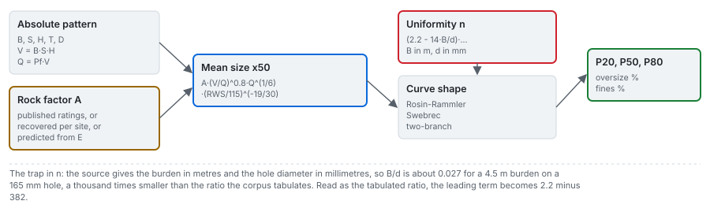

# Classical mean size

Arms `kuznetsov` (rock factor recovered for the site) and `kuznetsov-transfer` (rock factor predicted
from the modulus over the training sites). Closed form, evaluated in microseconds, recomputed live in
the browser.

---

## 1. The equation

Kuznetsov (1973) related the mean fragment diameter to the explosive energy and the rock volume each
hole breaks. With Cunningham's explosive-strength correction it is the basis of the Kuz-Ram family,
and both of this product's held sources print it in this form, with the size in centimetres, the
volume in cubic metres and the charge in kilograms:

$$
x_{50} = A\left(\frac{V}{Q}\right)^{0.8} Q^{1/6}\left(\frac{\mathrm{RWS}}{115}\right)^{-19/30}
\qquad\text{(Hudaverdi et al. 2010, Eq. 1)}
$$

| Symbol | Meaning | Unit |
|---|---|---|
| $x_{50}$ | mean fragment size | cm in the equation; metres everywhere else in this product |
| $A$ | rock factor | dimensionless, 0.8 to 22 |
| $V$ | rock volume broken per hole, $B\,S\,H$ | m3 |
| $Q$ | explosive mass in that hole, $P_f\,V$ | kg |
| RWS | weight strength relative to ANFO | ANFO 100, TNT 115 |

Because $V/Q$ is the reciprocal of the powder factor $K$, Amoako, Jha and Zhong (2022) write the same
equation in $K$:

$$
x_{50} = A\,K^{-0.8}\,Q^{1/6}\left(\frac{115}{\mathrm{RWS}}\right)^{19/20},\qquad K = \frac{Q}{V}
\qquad\text{(Amoako et al. 2022, Eq. 3)}
$$

The two forms agree on the energy term and differ on the strength exponent: $-19/30$ on
$\mathrm{RWS}/115$ in one and $19/20$ on $115/\mathrm{RWS}$ in the other, which separates the results by
about 8 percent at an RWS of 140. On this corpus it does not matter in practice, because every blast
used ANFO (RWS 100), and back-solving the rock factor from the published predictions settles it
anyway: with the $-19/30$ form the recovered factor is near constant within each site, and with the
other it is not. The $-19/30$ form is the default; the engine ships the other as a named variant.

## 2. What applying it to this corpus needs

Two things the corpus does not print.

**The absolute pattern.** $V$ and $Q$ come from the pattern in metres, recovered from the ratios and
the hole diameters stated in the source prose ([data/03](../data/03_geometry.md)). For the Miami
campaign the source publishes no absolute dimension, so the six Miami blasts are not reconstructed and
both classical arms abstain there, each with the reason in the artifact.

**A rock factor.** It comes by one of two routes ([methods/03](03_rock-factor.md)):

- `kuznetsov`: the factor recovered for the site by inverting the equation on the 2012 paper's
  published classical predictions. Those predictions are for hold-out blasts of the same sites, so
  this arm reads a constant derived from the site it predicts, and its provenance says so
  (`uses_site_constant`).
- `kuznetsov-transfer`: the factor predicted from the Young modulus by a line fitted over the
  training sites only, one point per site, so the arm uses nothing from the held-out site:

$$
\ln \hat A = a + b \ln \bar E_s,\qquad (a, b)\ \text{fitted by least squares over the training sites with a recovered factor}
$$

The transfer line is a calibration of this product and the engine, not a published relation. With
fewer than three training sites it refuses to fit. On the whole corpus:

<!-- facts:transfer-line -->
Fitted on the 9 sites with a recovered factor: ln A = 0.3841 + 0.5029 ln E. Each case refits it without its own site.
<!-- /facts -->

## 3. Where it fails

**On the published hold-out.** The 2012 paper prints the classical prediction for twelve hold-out
blasts next to the measurement. Scored as printed:

<!-- facts:holdout-2012 -->
| model, as printed in the 2012 paper | variance explained | squared correlation | RMSE, m |
|---|---|---|---|
| classical | 0.232 | 0.570 | 0.1279 |
| regression | 0.708 | 0.820 | 0.0788 |
| neural network | 0.910 | 0.937 | 0.0439 |
| null, the training mean | -0.009 | n/a | 0.1466 |
<!-- /facts -->

The classical column is the weakest of the three printed models, and its squared correlation is more
than twice its variance explained: the literature's usual "R2" would report it at about 0.57.

**Fines.** Its best-documented failure is under-predicting the fine fraction, which motivates the
crush-zone composition in [methods/04](04_distribution-shapes.md).

**On this product's own reproduction of that table.** This product's classical arm reproduces the
printed classical column almost exactly on the hold-out, and that agreement is circular: the rock
factors were back-solved from that very column. The evidence that the geometry and the equation's
form are right is different: the recovered factor barely varies within each site.

## 4. Evidence on this corpus

<!-- facts:arm-kuznetsov -->
Evidence for **classical mean size, site factor** in the committed benchmark (variance explained about the identity line):

- random 80/20, 100 draws: median 0.303, 5th to 95th percentile -0.59 to 0.74;
- deduplicated, 100 draws: median 0.310;
- held out by site, every blast: 0.311 (site-resampled 95 percent interval -0.96 to 0.70, 6 blasts abstained);
- held out by site, the 91 blasts with geometry: 0.311 (-0.97 to 0.69);
- error by held-out campaign: lowest at Murgul (0.052 m RMSE), highest at Dongri-Buzurg (0.330 m).

Provenance: it reads a constant derived from the held-out site itself.
<!-- /facts -->

<!-- facts:arm-kuznetsov-transfer -->
Evidence for **classical mean size, transfer factor** in the committed benchmark (variance explained about the identity line):

- random 80/20, 100 draws: median 0.312, 5th to 95th percentile -0.57 to 0.69;
- deduplicated, 100 draws: median 0.331;
- held out by site, every blast: 0.298 (site-resampled 95 percent interval -1.10 to 0.72, 6 blasts abstained);
- held out by site, the 91 blasts with geometry: 0.298 (-1.10 to 0.71);
- error by held-out campaign: lowest at Akdaglar (0.057 m RMSE), highest at Dongri-Buzurg (0.290 m).
<!-- /facts -->

Read together: the classical score barely depends on the protocol, because the equation has no
parameter fitted to the training rows, and it barely depends on where its rock factor comes from, so
it is not borrowed from the held-out site. Its interval still spans zero: with ten sites, its skill is
not distinguishable from predicting the corpus mean. The engine's probe that replaces the transfer
line with the median training factor loses about half the score (engine
[methods/07](https://github.com/fsantibanezleal/CAOS_BlastFrag/blob/main/docs/methods/07_transfer.md)),
so the modulus carries most of what the site factor knew.

## 5. In the application

- **Predict** plots the selected arm's prediction against the measurement for every blast of the
  case, with its score on the case and a table of every model; both classical arms are in the rail's
  model selector, whose description says where each one's rock factor comes from.
- **Rock** computes the two Lilly rating schemes live from rock-mass inputs you set, next to the
  factor recovered for the site.
- **What if** recomputes both arms live as the design changes; the transfer arm uses the line fitted
  for the open case, without its own campaign.

## Sources

- Kuznetsov, V. M. (1973). The mean diameter of the fragments formed by blasting rock. *Soviet Mining Science* 9:144-148. [doi:10.1007/BF02506177](https://doi.org/10.1007/BF02506177)
- Hudaverdi, T., Kulatilake, P. H. S. W. and Kuzu, C. (2010). *Int. J. Numer. Anal. Methods Geomech.* 35:1318-1333. [doi:10.1002/nag.957](https://doi.org/10.1002/nag.957)
- Amoako, R., Jha, A. and Zhong, S. (2022). *Mining* 2:233-247. [doi:10.3390/mining2020013](https://doi.org/10.3390/mining2020013)
- Kulatilake, P. H. S. W., Hudaverdi, T. and Wu, Q. (2012). *Geotech. Geol. Eng.* [doi:10.1007/s10706-012-9496-3](https://doi.org/10.1007/s10706-012-9496-3)
- Engine derivation: [blastfrag docs/methods/01_classical.md](https://github.com/fsantibanezleal/CAOS_BlastFrag/blob/main/docs/methods/01_classical.md) and [07_transfer.md](https://github.com/fsantibanezleal/CAOS_BlastFrag/blob/main/docs/methods/07_transfer.md)
