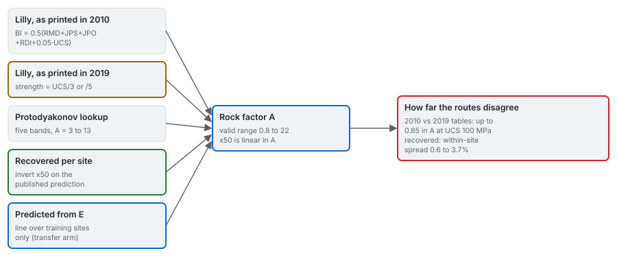

# The rock factor

One dimensionless number, $A$, carries everything the classical equation knows about the rock. Three
published schemes compute it differently, a fourth is recovered from the published predictions, and
a fifth predicts it from the modulus over training sites only.

---

## 1. From a three-value lookup to a rating sum

In its original form the factor was a lookup: 7 for medium rock, 10 for hard, highly fissured rock,
13 for very hard, weakly fissured rock. Hudaverdi et al. (2010) say those categories are too wide.
Cunningham's route out is Lilly's blastability index, which the 2010 paper prints as:

$$
A = 0.06\,\mathrm{BI},\qquad \mathrm{BI} = 0.5\,(\mathrm{RMD} + \mathrm{JPS} + \mathrm{JPO} + \mathrm{RDI} + S)
$$

| Term | Meaning | Rating (Hudaverdi et al. 2010) |
|---|---|---|
| RMD | rock-mass description | powdery 10, blocky 20, massive 50 |
| JPS | joint plane spacing | under 0.1 m: 10; 0.1 to 1.0 m: 20; over 1.0 m: 50 |
| JPO | joint plane orientation | horizontal 10, out of face 20, normal to face 30, into face 40 |
| RDI | density influence | $25\,\rho - 50$, $\rho$ the density in t/m3 |
| $S$ | strength | $0.05 \times \mathrm{UCS}$, UCS in MPa |

## 2. The same attribution, a different table

Babaeian et al. (2019) publish a second table attributed to Lilly, and it is not the same table. The
strength term is the compressive strength divided by 3 below 50 GPa of modulus, or by 5 above it,
instead of 0.05 times the strength. At 100 MPa that is 5 against 33.3 or 20; it moves the index by up
to 14 points and the factor by up to 0.85, and the predicted size is linear in the factor.

The same source tabulates a third route, Hustrulid's, which maps the Protodyakonov strength index
straight onto a factor in five bands, 3 for very soft rock to 13 for rigid, homogeneous rock.

The engine ships all three, named, each with its source. A scheme that needs a compressive strength
and is not given one raises rather than assuming a value, because an assumed strength produces a
rock factor, and so a fragment size, with no evidence behind it.

## 3. Recovered from the published predictions

Both source papers say the rock factor was estimated for each blast, and neither prints the value.
Inverting the classical equation on a published prediction, with the recovered geometry
([data/03](../data/03_geometry.md)), gives it back:

$$
A = \frac{x_{50}^{\mathrm{pub}}}{(V/Q)^{0.8}\,Q^{1/6}\,(\mathrm{RWS}/115)^{-19/30}}\qquad (x_{50}\ \text{in cm})
$$

The recovered values (per site, in [results/04](../results/04_per-site.md), "The campaigns") barely
move within a site: the widest spread is 3.7 percent, which is what rounding the published
predictions to two decimals produces. An error in the reconstructed burden or bench height would
scatter them. So this one result checks the geometry reconstruction, selects between the two
published spellings of the strength exponent ([methods/02](02_classical-mean-size.md)), and recovers a
constant the literature omitted. Every value lands inside the published range of 0.8 to 22.

**The ordering is mostly, not entirely, by stiffness.** The recovered factors correlate with the
Young modulus at 0.87 (engine
[methods/03](https://github.com/fsantibanezleal/CAOS_BlastFrag/blob/main/docs/methods/03_rock-factor.md)),
and the folded 60 GPa schist at Enusa sits below the 45 GPa carbonates at Reocin. A folded schist is
not a massive carbonate, and the structural terms of every rating scheme exist for that reason; the
engine's test pins this inversion rather than asserting monotonicity.

**Which published column.** The two papers print different classical predictions for the same
blasts, so they imply different factors: Murgul comes out at 9.23 from the 2012 column and 10.05 from
the 2010 one, and the 2010 column implies a higher factor at every shared site. The recovery uses the
2012 column, the table that carries all three published arms, and says so.

**Miami** has no recoverable geometry, so no factor is recovered for it, and the classical arm
abstains there rather than borrowing a neighbour's.

## 4. Predicted from the modulus: the transfer line

The recovered factor for a site comes from published predictions for blasts of that same site. Under
leave-one-site-out, an arm that uses it reads information about the held-out site that the learned
arms do not receive. The transfer route removes that: for each split, one point per training site,

$$
\ln A_s = a + b \ln \bar E_s,\qquad \hat A(E) = \exp(a + b \ln E),
$$

fitted by ordinary least squares, so a 22-blast quarry and a six-blast mine weigh the same. The
modulus is used because it is the one rock property recorded for every blast, the one Hudaverdi et al.
chose to represent mechanical behaviour, and the one both 2025 studies rank first.

<!-- facts:transfer-line -->
Fitted on the 9 sites with a recovered factor: ln A = 0.3841 + 0.5029 ln E. Each case refits it without its own site.
<!-- /facts -->

The line is a calibration, not a published relation. It sees no rock-mass structure: block size and
joint orientation enter the rating schemes and not this line. Below the training sites' modulus range
it extrapolates; the five field blasts at 5.6 GPa, under the corpus minimum of 9.57, carry the
extrapolation stamp.

## 5. Where each route holds

| Route | Needs | Holds where | Fails where |
|---|---|---|---|
| Lilly, 2010 table | rock-mass description, joint spacing and orientation, density, UCS | a site with mapped structure and lab strength | the corpus: no blast carries joint data |
| Lilly, 2019 table | the same, and the modulus | as above | as above; disagrees with the 2010 table by up to 0.85 |
| Hustrulid, Protodyakonov | the Protodyakonov index | a quick class-level estimate | resolution: five bands |
| Recovered per site | a published classical prediction and the geometry | the nine corpus sites with geometry | any new site; Miami |
| Transfer line | the modulus | inside the training modulus range | below 9.57 GPa; where structure dominates |

## 6. Evidence on this corpus

The two classical arms differ only in the route to $A$ (their pooled scores are in
[methods/02](02_classical-mean-size.md) section 4). Per held-out campaign, the factor each route
gives and the error each arm makes:

<!-- facts:rock-routes -->
| held-out campaign | E, GPa | A recovered for the site | A from the line on all sites | site-factor arm, RMSE m | transfer arm, RMSE m |
|---|---|---|---|---|---|
| Akdaglar | 16.9 | 6.72 | 6.09 | 0.054 | 0.057 |
| Dongri-Buzurg | 9.57 | 3.68 | 4.57 | 0.330 | 0.290 |
| Enusa | 60.0 | 10.97 | 11.51 | 0.147 | 0.175 |
| Miami | 10.0 | no geometry | 4.67 | abstains | abstains |
| Mrica | 32.0 | 6.32 | 8.39 | 0.111 | 0.213 |
| Murgul | 50.0 | 9.23 | 10.50 | 0.052 | 0.110 |
| Ozmert | 15.0 | 6.44 | 5.73 | 0.061 | 0.061 |
| Reocin | 45.0 | 12.14 | 9.96 | 0.216 | 0.166 |
| Reocin-UG | 45.0 | 11.19 | 9.96 | 0.093 | 0.086 |
| Soma | 13.25 | 6.24 | 5.39 | 0.132 | 0.076 |

The line column uses the fit on all nine sites with a recovered factor, for comparison; in the benchmark each held-out campaign is predicted by a line refitted without it.
<!-- /facts -->

Per site the two routes trade places, which is what one line across ten rocks would be expected to
do; where the transfer factor is far from the recovered one, the error moves with it.

## In the application

The **Rock** tab of the App computes the two Lilly schemes live (scheme A with the 2010 strength term,
scheme B with the 2019 one) from the rock-mass description, joint spacing and orientation, density and
strength you set, beside the factor recovered for the selected site, and lists what the corpus does
publish for the blast, including its stiffness group. The transfer factor appears in the Design group,
through the transfer arm.

## Sources

- Hudaverdi, T., Kulatilake, P. H. S. W. and Kuzu, C. (2010). *Int. J. Numer. Anal. Methods Geomech.* 35:1318-1333. [doi:10.1002/nag.957](https://doi.org/10.1002/nag.957)
- Babaeian, M., Ataei, M., Sereshki, F., Sotoudeh, F. and Mohammadi, S. (2019). A new framework for evaluation of rock fragmentation in open pit mines. *J. Rock Mech. Geotech. Eng.* 11:325-336. [doi:10.1016/j.jrmge.2018.11.006](https://doi.org/10.1016/j.jrmge.2018.11.006)
- Kulatilake, P. H. S. W., Hudaverdi, T. and Wu, Q. (2012). *Geotech. Geol. Eng.* [doi:10.1007/s10706-012-9496-3](https://doi.org/10.1007/s10706-012-9496-3)
- Sui, Y. et al. (2025). *Applied Sciences* 15:1254. [doi:10.3390/app15031254](https://doi.org/10.3390/app15031254)
- Engine derivation: [blastfrag docs/methods/03_rock-factor.md](https://github.com/fsantibanezleal/CAOS_BlastFrag/blob/main/docs/methods/03_rock-factor.md)
