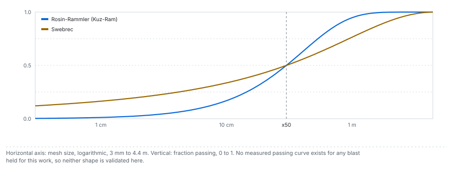

# Distribution shapes

From a mean size to a passing curve: Rosin-Rammler with Cunningham's uniformity index, the Swebrec
function, and the crush-zone composition. All three share the classical mean size, so for the mean
size they are one predictor, and the benchmark counts them once.

---

## 1. Why a curve and not a number

A crusher is specified against the 80 percent passing size, an oversize limit and a fines fraction,
which are points on the curve away from the median. The mean size alone does not say how much of the
muckpile is oversize or how much is fines; the curve's shape does.

## 2. Rosin-Rammler written on the mean size

$$
P(x) = 1 - \exp\!\left[-0.693\left(\frac{x}{x_{50}}\right)^{n}\right]
\qquad\text{(Amoako et al. 2022, Eq. 5)}
$$

$P(x)$ is the fraction passing a mesh of size $x$. The 0.693 is $\ln 2$, which makes $x_{50}$ the
50 percent size rather than the characteristic size; the characteristic size, through which 63.2
percent passes, is $x_{50}/0.693^{1/n}$. Any percentile follows in closed form:

$$
x_p = x_{50}\left(\frac{-\ln(1-p)}{\ln 2}\right)^{1/n},\qquad
P_{80} = x_{50}\left(\frac{\ln 5}{\ln 2}\right)^{1/n}
$$

## 3. The uniformity index

Cunningham's index sets how tightly the curve gathers around its median. As printed in Amoako et al.
(2022), Eq. 7:

$$
n = \left(2.2 - 14\frac{B}{d}\right)\sqrt{\frac{1 + S/B}{2}}\left(1 - \frac{W}{B}\right)
\left(\left|\frac{\mathrm{BCL}-\mathrm{CCL}}{L}\right| + 0.1\right)^{0.1}\frac{L}{H}
$$

| Symbol | Meaning | Unit |
|---|---|---|
| $B, S$ | burden and spacing | m |
| $d$ | hole diameter | **mm** |
| $W$ | standard deviation of drilling accuracy | m |
| BCL, CCL | bottom-charge and column-charge lengths | m |
| $L$ | charge length, $H + J - T$ floored at zero; subdrill $J = 0$ here, as no source publishes it | m |
| $H$ | bench height | m |

Multiply by 1.1 for a staggered pattern. High values mean uniform sizing; low values a wide spread
carrying both oversize and fines. The source gives the usual range as 0.7 to 2.

**Three decisions of this product.**

1. **The unit trap in $B/d$.** The burden is in metres and the diameter in millimetres, so $B/d$ is
   about 0.027 for a 4.5 m burden on a 165 mm hole. It is not the dimensionless burden-to-diameter
   ratio the corpus tabulates (27.27 for the same hole). Read as the ratio, the leading term becomes
   $2.2 - 382$ and the index goes to about $-380$. A test asserts the index lands in a physical band
   on every reconstructable blast.
2. **The charge-distribution term.** The corpus does not publish a split between bottom and column
   charge. A single continuous ANFO column has no such split, so the term reduces to
   $0.1^{0.1} \approx 0.794$ rather than an invented split.
3. **Drilling deviation $W = 0$**, because no source publishes it.

Where the index leaves its band, the pattern is unusual rather than the equation broken: 62 of the 91
reconstructable blasts sit inside 0.7 to 2, and every one below the band has a charge column short
relative to its bench, because the stemming takes most of the hole. One Enusa blast carries stemming
of 1.17 burdens in a bench 1.33 burdens tall, and its index is 0.18. The degenerate control
([cases/02](../cases/02_the-controls.md)) has no charge column at all, and its index is exactly zero.

## 4. Swebrec

Ouchterlony's three-parameter function adds an explicit upper size and an undulation that shapes the
fines branch. As printed in Amoako et al. (2022), Eqs. 10 and 11:

$$
P(x) = \frac{1}{1 + \left[\dfrac{\ln(x_{\max}/x)}{\ln(x_{\max}/x_{50})}\right]^{b}},\qquad 0 < x < x_{\max}
$$

| Parameter | Value here | Source |
|---|---|---|
| $x_{50}$ | the classical mean size | [methods/02](02_classical-mean-size.md) |
| $x_{\max}$ | the larger of burden and spacing | convention stated in the source |
| $b$ | 2 by default, user-adjustable | no published fit for this corpus |

Amoako and colleagues write that it is more adaptable and predicts fines better. Babaeian et al.
(2019) report a bauxite mine, 24 blasts measured by image analysis, where the two-parameter form
landed closer to the measurement and the authors concluded that site follows Rosin-Rammler. Swebrec
is more adaptable in general and not better everywhere.

## 5. The crush-zone composition

The two-component and crush-zone models separate two mechanisms: tensile fracturing produces the
coarse fraction, and compressive-shear fracturing in the crushed zone around the hole produces the
fines. Amoako et al. (2022) put the motivation plainly: a major shortfall of the Kuz-Ram model is the
underestimation of fines. The engine composes the two branches by mass. The coarse branch is the
classical Rosin-Rammler curve; the fines branch is a second Rosin-Rammler curve with its median at the
crossover size and a lower uniformity; the fines branch carries exactly its stated mass fraction $w$:

$$
P(x) = w\,P_{\mathrm{RR}}(x;\ x_c,\ n_f) + (1 - w)\,P_{\mathrm{RR}}(x;\ x_{50},\ n),
\qquad 0 \le w < 1,\quad x_c < x_{50}
$$

where $P_{\mathrm{RR}}(x;\,m,\,k) = 1 - \exp[-\ln 2\,(x/m)^k]$. A crossover at or above the mean size
leaves no coarse branch to compose with, and the engine refuses it.

The structure is sourced; its constants are not, because the 1999 papers that introduced them are
proceedings not held for this work. So $x_c$, $n_f$ and $w$ are user parameters with stated starting
values (0.01 m, 0.8 and 0.05 in the engine), not published ones, and every curve carries
`constants_are_published: false` in its detail.

## 6. The 2005 modification and timing

Cunningham revised both equations in 2005, mainly because of electronic delay detonators: the mean
size is multiplied by a timing factor and a rock-factor correction, and the index gains a
timing-scatter factor. None of those four multipliers is printed in any primary source held for this
work, so they default to one and are user parameters. The timing factor is a scalar: it has no
spatial structure, so changing a tie-in or the initiation direction changes the bench animation and
nothing in the prediction.

## 7. Where the shapes fail, and what would validate them

No dataset available for this work carries a measured passing curve, so no shape is validated here.
Every P80 on the site, including the design-response map on Experiments, is therefore a model output
and labelled as one. What would
validate one is a set of blasts with both the design and a curve measured by sieving or by calibrated
image analysis; three-dimensional scanning of the muckpile (Li et al. 2023) is an alternative
measurement channel a future corpus could use.

## In the application

- **Distribution** (App) draws the selected blast's curves on a logarithmic size axis with their P20,
  P50 and P80.
- **Against a target** (App, Distribution) compares the predicted P80 against a crusher specification
  you set.
- **Design response** (Experiments) maps the live P80 over burden-to-diameter and spacing-to-burden,
  with an iso-line at a chosen specification.

## Sources

- Amoako, R., Jha, A. and Zhong, S. (2022). *Mining* 2:233-247. [doi:10.3390/mining2020013](https://doi.org/10.3390/mining2020013)
- Ouchterlony, F. (2005). The Swebrec function: linking fragmentation by blasting and crushing. *Mining Technology* 114:29-44. [doi:10.1179/037178405X44539](https://doi.org/10.1179/037178405X44539)
- Babaeian, M. et al. (2019). *J. Rock Mech. Geotech. Eng.* 11:325-336. [doi:10.1016/j.jrmge.2018.11.006](https://doi.org/10.1016/j.jrmge.2018.11.006)
- Ouchterlony, F. and Sanchidrián, J. A. (2019). *J. Rock Mech. Geotech. Eng.* 11:1094-1109. [doi:10.1016/j.jrmge.2019.03.001](https://doi.org/10.1016/j.jrmge.2019.03.001)
- Li, P., Xie, S., Xia, H., Wang, D. and Xu, Z. (2023). Advanced analysis of blast pile fragmentation in open-pit mining utilizing 3D point cloud technology. *Traitement du Signal* 40:6. [doi:10.18280/ts.400615](https://doi.org/10.18280/ts.400615)
- Engine derivation: [blastfrag docs/methods/02_distributions.md](https://github.com/fsantibanezleal/CAOS_BlastFrag/blob/main/docs/methods/02_distributions.md)
