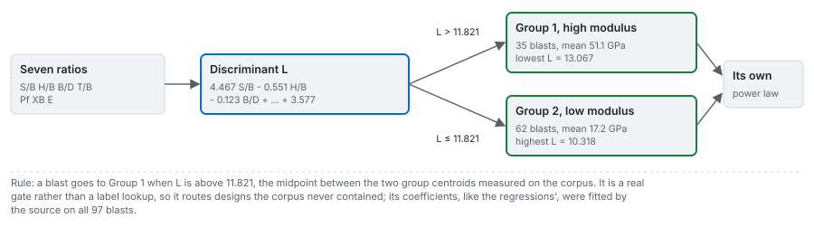

# Router and regressions

Arms `group-discriminant` (the router), `published-regression` (the source's coefficients) and
`refitted-regression` (the same functional form, refitted on each split's training rows). All three
work on the seven ratios alone, with no absolute geometry.

---

## 1. Two stiffness groups

Hudaverdi, Kulatilake and Kuzu (2010) split the 97 blasts by hierarchical average-linkage clustering
on Pearson correlation distance over standardised features. Two groups came out: 35 high-modulus
blasts averaging 51.14 GPa and 62 low-modulus blasts averaging 17.22 GPa. Their discriminant analysis
identifies the modulus as the dominant separator (Wilks' lambda 0.161, F 540.8) and finds that the
spacing-to-burden ratio has no effect on membership (lambda 0.988, F 0.971, significance 0.280).

## 2. The router

The discriminant function, Hudaverdi et al. (2010) Eq. 8, canonical correlation 0.973:

$$
L = 4.467\tfrac{S}{B} - 0.551\tfrac{H}{B} - 0.123\tfrac{B}{D} + 1.642\tfrac{T}{B} - 3.005\,P_f + 0.309\,X_B + 0.208\,E + 3.577
$$

A blast goes to group 1 when $L > 11.821$, the midpoint between the two group centroids measured on
the corpus. It reproduces the published membership of all 109 labelled blasts (97 corpus, 12 hold-out)
with no error, and the groups do not overlap: the low group's maximum $L$ is 10.318 and the high
group's minimum 13.067. Because it is a function of the inputs rather than a site label, it routes
designs the corpus does not contain.

The router predicts a group, not a size, so as a fragment-size arm it abstains on every blast, with
that reason. It is in the ladder because the regressions and the network depend on it, and its
accuracy bounds theirs.

## 3. The two published power laws

Each group has its own power law in the seven ratios, Hudaverdi et al. (2010) Eqs. 9 and 10 (the same
as Kulatilake et al. 2012, Eqs. 15 and 16), with $x_{50}$ in metres:

$$
x_{50}^{(1)} = 208\left(\tfrac{S}{B}\right)^{2.788}\left(\tfrac{H}{B}\right)^{0.112}\left(\tfrac{B}{D}\right)^{0.027}\left(\tfrac{T}{B}\right)^{-0.321}P_f^{-0.360}X_B^{0.233}E^{-1.802}
$$

$$
x_{50}^{(2)} = 0.60\left(\tfrac{S}{B}\right)^{0.547}\left(\tfrac{H}{B}\right)^{0.535}\left(\tfrac{B}{D}\right)^{0.427}\left(\tfrac{T}{B}\right)^{-0.101}P_f^{-0.115}X_B^{0.434}E^{-1.202}
$$

| | Group 1, high modulus | Group 2, low modulus |
|---|---|---|
| blasts | 35 | 62 |
| R, R2, adjusted R2 | 0.841, 0.708, 0.632 | 0.859, 0.739, 0.705 |
| standard error, F | 0.0916, 9.356 | 0.1119, 22.808 |

**Reading the signs.** The size rises with the spacing ratio, the burden-to-diameter ratio and the
block size; falls with the stemming ratio and the powder factor; and falls with the modulus in both
groups.

**An apparent unit error that is not one.** The two leading coefficients differ by a factor of 347
and both equations return metres. The modulus exponents differ by 0.6 over a range of 9.57 to 60 GPa,
and the modulus term absorbs the gap. This was checked numerically before the coefficients were
accepted, and an engine test pins it.

## 4. The equations beat their own papers' tables

Both papers print these equations and also a table of predictions made with them. Recomputing the
equations and scoring on the same rows gives more than the printed tables (the figures are in
[results/05](../results/05_published-reproductions.md)). The two papers print different figures for
five rows (Mr12, Sm8, Oz9, Ad23, Ad24) despite using the same equations; the recomputation matches the
2010 figure on four and never the 2012 one, and Ad24 matches neither by about 0.02 m. A sixth row,
Db10, matches neither paper by a factor of two (0.324 m recomputed against 0.16 printed in both), and
the reproduced network disagrees with the printed figure there in the same direction; the engine
tested whether one input cell is wrong and no single cell reconciles both models, so the row is
carried with its published inputs and the inconsistency recorded.

## 5. The refit, and what each regression arm measures

The refit takes the same functional form and fits it on each split's training rows. In logarithms it
is linear, so it is ordinary least squares with no optimiser:

$$
\ln x_{50} = \ln c_g + \sum_{j=1}^{7} \beta_{g,j}\,\ln z_j,\qquad g \in \{1, 2\}\ \text{chosen by the router}
$$

It refuses to fit a group with seven or fewer rows, because seven exponents from seven rows is an
interpolation. A prediction outside the plausible size range (0.001 to 3 m) is refused with the value
in the reason; with Murgul held out, for example, the group-1 refit returns 10.48 m for blast Mg1 and
the arm abstains there, in the bake and in the browser alike.

**The two arms answer different questions.** The source fitted the router and both published power
laws on these same 97 blasts, so no protocol that splits this corpus hides a blast from them: the
published regression's score under any split is its in-sample fit, and its provenance carries
`in_sample_corpus`. Its out-of-sample evidence is the two published hold-outs, from the same sites.
The transfer test of this functional form is the refit, which also inherits the in-sample router
(`router_in_sample`).

## 6. Evidence on this corpus

<!-- facts:arm-published-regression -->
Evidence for **published regression** in the committed benchmark (variance explained about the identity line):

- random 80/20, 100 draws: median 0.805, 5th to 95th percentile 0.65 to 0.93;
- deduplicated, 100 draws: median 0.837;
- held out by site, every blast: 0.802 (site-resampled 95 percent interval 0.57 to 0.90);
- held out by site, the 91 blasts with geometry: 0.781 (0.50 to 0.88);
- error by held-out campaign: lowest at Miami (0.011 m RMSE), highest at Dongri-Buzurg (0.160 m).

Provenance: its coefficients were fitted by its source on this corpus, so no split hides a blast from it.
<!-- /facts -->

<!-- facts:arm-refitted-regression -->
Evidence for **refitted regression** in the committed benchmark (variance explained about the identity line):

- random 80/20, 100 draws: median 0.686, 5th to 95th percentile 0.39 to 0.87;
- deduplicated, 100 draws: median 0.715;
- held out by site, every blast: -4.075 (site-resampled 95 percent interval -19.48 to 0.02, 4 blasts abstained);
- held out by site, the 91 blasts with geometry: -4.601 (-21.92 to 0.09);
- error by held-out campaign: lowest at Soma (0.048 m RMSE), highest at Murgul (1.618 m).

Provenance: it is routed by the published discriminant, which was fitted on this corpus.
<!-- /facts -->

The gap between the two is the measure of what the published coefficients know about the held-out
site. With nine sites left, the refit's group-1 exponents can swing far from the published ones (the
Murgul fold puts an exponent of about $-13.7$ on the spacing ratio), which is the extrapolation the
plausibility guard catches.

## In the application

- **Predict** plots the published regression or the refit (chosen in the rail) against the
  measurement for every blast of the case.
- **Rock** shows the stiffness group the router assigns to the selected blast.
- **Design** recomputes the router, the published power law and the refit (from its exported
  exponents for the open case) on the changed design, cell by cell on the response surface.

## Sources

- Hudaverdi, T., Kulatilake, P. H. S. W. and Kuzu, C. (2010). *Int. J. Numer. Anal. Methods Geomech.* 35:1318-1333. [doi:10.1002/nag.957](https://doi.org/10.1002/nag.957)
- Kulatilake, P. H. S. W., Hudaverdi, T. and Wu, Q. (2012). *Geotech. Geol. Eng.* [doi:10.1007/s10706-012-9496-3](https://doi.org/10.1007/s10706-012-9496-3)
- Engine derivation: [blastfrag docs/methods/04_statistical.md](https://github.com/fsantibanezleal/CAOS_BlastFrag/blob/main/docs/methods/04_statistical.md)
