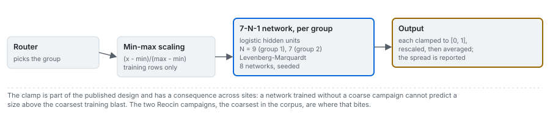

# The published network

Arm `published-neural-net`: the network of Kulatilake, Hudaverdi and Wu (2012), reproduced to its
published specification, trained per stiffness group, and run in the browser from its exported
weights.

---

## 1. The specification

The 2012 paper specifies the network completely:

- seven inputs, one hidden layer of $N$ logistic units, one linear output; the single hidden layer is
  justified with Cybenko's universal-approximation result (Cybenko 1989);
- trained separately on each stiffness group, on that group's rows only, with the group chosen by the
  router of [methods/05](05_router-and-regressions.md);
- inputs and target min-max normalised (the source's Eq. 11);
- Levenberg-Marquardt training, chosen after comparing four algorithms for its stability and for
  reaching the minimum in fewer cycles;
- the hidden width swept from 6 to 15, the range two published heuristics allow, with eight
  simulations at each width, scored by root mean square error and correlation;
- published optima: 9 hidden units for the high-modulus group and 7 for the low-modulus group, which
  are the widths this product uses.

The forward pass, with $\sigma$ the logistic function:

$$
\hat y = \sum_{j=1}^{N} w^{(2)}_j\,\sigma\!\left(\sum_{i=1}^{7} w^{(1)}_{ij} z_i + b^{(1)}_j\right) + b^{(2)},
\qquad z_i = \frac{x_i - x_i^{\min}}{x_i^{\max} - x_i^{\min}}
$$

## 2. Training: Levenberg-Marquardt

No mainstream Python library ships Levenberg-Marquardt for neural networks, and gradient descent
would not be the published method, so the engine implements it in numpy. Each step solves a damped
Gauss-Newton system:

$$
\left(J^{\top}J + \lambda I\right)\delta = -J^{\top} r
$$

with $J$ the Jacobian of the residuals $r$ with respect to the weights. The damping $\lambda$ rises
when a step increases the loss (the step moves toward gradient descent) and falls when it decreases it
(toward Gauss-Newton) (Marquardt 1963). The Jacobian is hand-derived and the engine's tests check it
against a central finite difference to better than 1e-7. The seed is drawn before any training, so a
network's initial weights do not depend on how many models were fitted earlier in the same process.

## 3. What this product sets

- **Eight simulations, averaged.** Each prediction is the mean of the eight networks; every prediction
  carries the eight values, their median and their coefficient of variation.
- **Clamped to the training range.** The target is normalised onto the unit interval, so each
  network's output is clamped to it before denormalising. Without the clamp the wildest simulations
  on row Ru7 average to zero and drag the arm's variance explained on that row from positive to
  -1.18.
- **The architecture is generous relative to the data.** Seven hidden units on 62 blasts is 64 free
  parameters; nine on 35 blasts is 82. The reproduction fits its training rows above 0.95 of variance
  explained, which is what over-parameterisation looks like.

## 4. The reproduction against the published figure

On the published twelve-blast hold-out, ten of the twelve rows reproduce the published network
closely, often within 0.01 to 0.03 m. The two that do not, Ru7 and Db10, are the two rows the source
itself reports as its most unstable, with coefficients of variation of 0.56 and 0.76 across its eight
simulations. Across seeds:

<!-- facts:seed-sweep -->
Over 30 seeds the reproduced network explains 0.167 to 0.636 of the variance on the 2012 hold-out (median 0.340); the published figure is 0.910, above every seed.
<!-- /facts -->

Per row: on Ru7 the reproduction spans the published value across seeds, so that row is seed luck;
on Db10 it stays far above the printed 0.33 m on every seed, a systematic disagreement on the same row
where the printed regression column disagrees with its own equation by a factor of two
([methods/05](05_router-and-regressions.md)). The per-seed range of every hold-out row is in
[results/05](../results/05_published-reproductions.md).

**What is claimed, and what is not.** It is not claimed that the published result is wrong:
unrecorded details, an initialisation scheme or a different simulation draw could account for it.
What the sweep establishes is that the published score is not robust to the seed, on a method its own
paper shows to be unstable between adjacent widths: in the low-modulus group, the correlation in its
Table 7 goes from 0.11 with six hidden units to 0.81 with seven and 0.49 with eight.

## 5. Held out by site

The clamp has a consequence when a whole site is held out: a network trained without a coarse
campaign cannot predict a size above the coarsest training blast. The two Reocin campaigns, the
coarsest in the corpus, are where that bites.

<!-- facts:arm-published-neural-net -->
Evidence for **published neural network** in the committed benchmark (variance explained about the identity line):

- random 80/20, 100 draws: median 0.362, 5th to 95th percentile -0.65 to 0.70;
- deduplicated, 100 draws: median 0.183;
- held out by site, every blast: -0.626 (site-resampled 95 percent interval -3.35 to 0.01);
- held out by site, the 91 blasts with geometry: -0.604 (-3.42 to 0.09);
- error by held-out campaign: lowest at Soma (0.044 m RMSE), highest at Reocin (0.367 m).

Provenance: it is routed by the published discriminant, which was fitted on this corpus.
<!-- /facts -->

### 5.1 The hidden width, reproduced and held out by site

The source chose the hidden width on its own hold-out, the rows it then reported. The engine's
`network_width_sweep` (0.4.0) asks two questions of that choice: does the source's procedure, reproduced,
land on the published widths, and does any width transfer to a site the network has not seen?

<!-- facts:width-sweep -->
Reproduced on the 2012 hold-out, the source's width selection picks 8 hidden units for the high-modulus group and 11 for the low, against the published 9 and 7. Held out by site, every width from 6 to 15 scores from -1.486 to -0.568, and the published pair -0.626; the null, which predicts the training mean, scores -0.216.
<!-- /facts -->

Neither the width nor the seed rescues the network across sites: the wider networks fail hardest, and
the published pair scores as the benchmark's arm does. The full tables are in
[results/05](../results/05_published-reproductions.md).

## 6. In the browser

The fitted networks of each training scope are exported as JSON (both groups, the eight simulations,
the normalisation bounds and the clamp) and the What if tab runs them in TypeScript. The browser test
reproduces the original network's prediction at all 116 published blasts to a relative difference
below 1e-12; the difference that remains comes from the exponential in the logistic function
([architecture/05](../architecture/05_portable-models.md)).

## Sources

- Kulatilake, P. H. S. W., Hudaverdi, T. and Wu, Q. (2012). New prediction models for mean particle size in rock blast fragmentation. *Geotech. Geol. Eng.* [doi:10.1007/s10706-012-9496-3](https://doi.org/10.1007/s10706-012-9496-3)
- Cybenko, G. (1989). Approximation by superpositions of a sigmoidal function. *Math. Control Signals Syst.* 2:303-314. [doi:10.1007/BF02551274](https://doi.org/10.1007/BF02551274)
- Marquardt, D. W. (1963). An algorithm for least-squares estimation of nonlinear parameters. *J. SIAM* 11:431-441. [doi:10.1137/0111030](https://doi.org/10.1137/0111030)
- Engine derivation: [blastfrag docs/methods/06_learned.md](https://github.com/fsantibanezleal/CAOS_BlastFrag/blob/main/docs/methods/06_learned.md)
