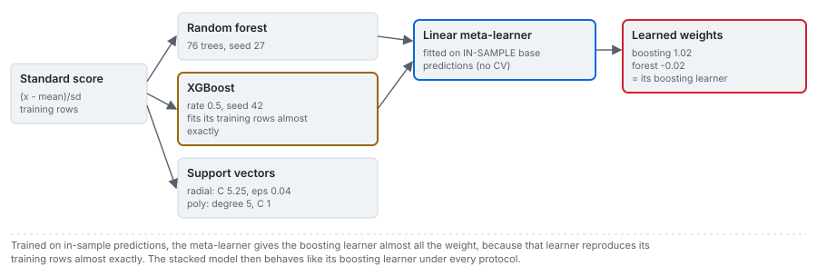

# Kernels, forests, boosting and stacking

Arms `svr-rbf`, `svr-poly`, `random-forest`, `xgboost` and `stacking`: the 2022 and 2025 learners
fitted on this same corpus, reproduced with their published hyperparameters.

---

## 1. Support-vector regression, two published parameterisations

Two sources fit support-vector regression to this corpus and reach opposite conclusions about the
kernel. Amoako et al. (2022) search 2700 combinations of four kernels and choose a radial kernel with
$C = 5.25$ and $\varepsilon = 0.04$, noting that radial models generalise better. Sui et al. (2025) use
a degree-5 polynomial with $C = 1$ and report it as the worst of their three single learners. Both
are reproduced, and kept separate; averaging them would hide the disagreement.

The regression is an expansion over the support vectors with an epsilon-insensitive loss (Smola and
Schölkopf 2004), on standardised inputs:

$$
\hat y(\mathbf z) = \sum_{i} \alpha_i\,K(\mathbf s_i, \mathbf z) + c,\qquad
K_{\mathrm{rbf}} = e^{-\gamma\lVert \mathbf s_i - \mathbf z\rVert^2},\qquad
K_{\mathrm{poly}} = (\gamma\,\mathbf s_i\!\cdot\!\mathbf z + c_0)^{5}
$$

$$
z_j = \frac{x_j - \mu_j}{\sigma_j},\quad (\mu_j, \sigma_j)\ \text{from the training rows of the split}
$$

## 2. Random forest and gradient boosting

The random forest averages $M$ regression trees, each grown on a bootstrap sample of the training rows
with a random subset of the inputs considered at each split (Breiman 2001). Gradient boosting adds
small trees, each fitted to the residual of the ones before, scaled by a learning rate $\eta$, from a
base value $b_0$ (Chen and Guestrin 2016):

$$
\hat y_{\mathrm{RF}}(\mathbf z) = \frac{1}{M}\sum_{m=1}^{M} T_m(\mathbf z),\qquad
\hat y_{\mathrm{XGB}}(\mathbf z) = b_0 + \sum_{k=1}^{K} \eta\, f_k(\mathbf z)
$$

| | Published final setting (Sui et al. 2025) | Used here |
|---|---|---|
| forest | 76 trees, seed 27 | the same |
| boosting | learning rate 0.5, seed 42; number of trees not printed | the same, with the library default of 100 trees |

The source reports its boosting model as overfitting, and that is reproduced rather than tuned away:
its training fit exceeds 0.98 of variance explained.

## 3. The stacked ensemble

The 2025 ensemble combines the forest and the boosting model with a linear meta-learner, chosen by the
source to avoid overfitting from excess complexity:

$$
\hat y_{\mathrm{stack}} = w_B\,\hat y_{\mathrm{XGB}} + w_F\,\hat y_{\mathrm{RF}} + c,\qquad
(w_B, w_F, c) = \arg\min \sum_{i\in\mathrm{train}}\left(y_i - w_B\,\hat y_{\mathrm{XGB}}(\mathbf z_i) - w_F\,\hat y_{\mathrm{RF}}(\mathbf z_i) - c\right)^2
$$

**Which predictions the meta-learner is fitted on.** In Wolpert's formulation of stacking (1992), the
meta-learner is trained on out-of-sample predictions of the base learners, produced by
cross-validation. Sui and colleagues write, in the paragraph describing their construction, that they
tried cross-validation and cancelled it because the cross-validated model predicted worse on the test
set. In a stacked model, the cross-validation that can be cancelled is the one that produces the
meta-learner's inputs out of sample, so this product (with the engine, since 0.3.0) fits the
meta-learner on the base learners' in-sample predictions. That reading is this product's; the source
does not spell out the mechanism.

The consequence: the boosting model reproduces its training rows almost exactly, so a meta-learner
trained on those rows gives it almost all the weight. Fitted on the whole corpus, the weights are about
1.02 on the boosting model and -0.02 on the forest, and the ensemble behaves like its boosting learner
under every protocol.

**Two parameter sets.** The source prints a second parameter set for its single learners (forest at
seed 1 with 50 trees, boosting at a rate of 1.9) and does not say unambiguously which set produced its
standalone figures of 0.797 and 0.758. The standalone arms here use the final set, the same learners
the ensemble contains, and are not presented as reproductions of those two figures.

## 4. The published random-split figures, among their reproductions

Sui et al. (2025) report, for the ensemble and for the polynomial kernel, one figure each from one
random 80/20 split. Reproducing that protocol a hundred times places each figure among its draws:

<!-- facts:published-splits -->
- stacking ensemble: published 0.943 on one random split; the reproduced draws have a median of 0.703, and 100 of 100 fall below the published figure.
- support vector, polynomial: published 0.578 on one random split; the reproduced draws have a median of 0.395, and 83 of 100 fall below the published figure.
<!-- /facts -->

A single random split of 97 grouped rows has a wide spread (see the 5th to 95th percentiles below), so
a published figure from one split says little about the method until it is placed among repeats.

## 5. Evidence on this corpus

<!-- facts:arm-svr-rbf -->
Evidence for **support vector, radial** in the committed benchmark (variance explained about the identity line):

- random 80/20, 100 draws: median 0.665, 5th to 95th percentile 0.22 to 0.81;
- deduplicated, 100 draws: median 0.651;
- held out by site, every blast: -0.387 (site-resampled 95 percent interval -1.61 to -0.06, 1 blasts abstained);
- held out by site, the 91 blasts with geometry: -0.466 (-1.86 to -0.07);
- error by held-out campaign: lowest at Soma (0.033 m RMSE), highest at Reocin-UG (0.417 m).
<!-- /facts -->

<!-- facts:arm-svr-poly -->
Evidence for **support vector, polynomial** in the committed benchmark (variance explained about the identity line):

- random 80/20, 100 draws: median 0.395, 5th to 95th percentile 0.09 to 0.66;
- deduplicated, 100 draws: median 0.396;
- held out by site, every blast: -4.546 (site-resampled 95 percent interval -16.24 to -0.83, 11 blasts abstained);
- held out by site, the 91 blasts with geometry: -4.811 (-17.18 to -0.95);
- error by held-out campaign: lowest at Soma (0.056 m RMSE), highest at Reocin-UG (1.156 m).
<!-- /facts -->

<!-- facts:arm-random-forest -->
Evidence for **random forest** in the committed benchmark (variance explained about the identity line):

- random 80/20, 100 draws: median 0.749, 5th to 95th percentile 0.55 to 0.90;
- deduplicated, 100 draws: median 0.753;
- held out by site, every blast: -0.231 (site-resampled 95 percent interval -2.78 to 0.38);
- held out by site, the 91 blasts with geometry: -0.233 (-2.88 to 0.40);
- error by held-out campaign: lowest at Ozmert (0.059 m RMSE), highest at Mrica (0.346 m).
<!-- /facts -->

<!-- facts:arm-xgboost -->
Evidence for **gradient boosting** in the committed benchmark (variance explained about the identity line):

- random 80/20, 100 draws: median 0.704, 5th to 95th percentile 0.48 to 0.85;
- deduplicated, 100 draws: median 0.702;
- held out by site, every blast: -0.034 (site-resampled 95 percent interval -2.23 to 0.42);
- held out by site, the 91 blasts with geometry: 0.034 (-1.78 to 0.53);
- error by held-out campaign: lowest at Reocin-UG (0.080 m RMSE), highest at Murgul (0.365 m).
<!-- /facts -->

<!-- facts:arm-stacking -->
Evidence for **stacking ensemble** in the committed benchmark (variance explained about the identity line):

- random 80/20, 100 draws: median 0.703, 5th to 95th percentile 0.47 to 0.85;
- deduplicated, 100 draws: median 0.699;
- held out by site, every blast: -0.035 (site-resampled 95 percent interval -2.25 to 0.42);
- held out by site, the 91 blasts with geometry: 0.034 (-1.81 to 0.54);
- error by held-out campaign: lowest at Reocin-UG (0.081 m RMSE), highest at Murgul (0.367 m).
<!-- /facts -->

Every learned arm loses most of its random-split score when a whole campaign is held out; the gap per
arm is in [results/03](../results/03_protocol-sensitivity.md). The importance views in
[results/06](../results/06_diagnostics.md) are consistent with one reading of that gap: the tree
models put most of their weight on the modulus, and the corpus has nine distinct modulus values over
ten sites (the two Reocin campaigns share 45 GPa), so within this corpus the modulus nearly identifies
the campaign. A split that keeps a campaign on both sides rewards a model for recognising it.

## 6. In the browser

The forest, the boosting model, the stack and the radial kernel of each training scope are exported
as flat JSON (every tree as four arrays: left child, right child, feature, threshold or leaf value)
and walked in TypeScript. The tree models reproduce the original predictions exactly, which needs
32-bit rounding of the inputs and, for XGBoost, of its printed thresholds and its leaf sum; the kernel
reproduces them to a relative 1e-12. The polynomial kernel is not exported, because the live lane shows
one kernel per family and the radial one is the better of the two on every protocol. Details in
[architecture/05](../architecture/05_portable-models.md).

## Sources

- Amoako, R., Jha, A. and Zhong, S. (2022). *Mining* 2:233-247. [doi:10.3390/mining2020013](https://doi.org/10.3390/mining2020013)
- Sui, Y., Zhou, Z., Zhao, R., Yang, Z. and Zou, Y. (2025). *Applied Sciences* 15:1254. [doi:10.3390/app15031254](https://doi.org/10.3390/app15031254)
- Smola, A. J. and Schölkopf, B. (2004). A tutorial on support vector regression. *Statistics and Computing* 14:199-222. [doi:10.1023/B:STCO.0000035301.49549.88](https://doi.org/10.1023/B:STCO.0000035301.49549.88)
- Breiman, L. (2001). Random forests. *Machine Learning* 45:5-32. [doi:10.1023/A:1010933404324](https://doi.org/10.1023/A:1010933404324)
- Chen, T. and Guestrin, C. (2016). XGBoost: a scalable tree boosting system. *Proc. 22nd ACM SIGKDD*, 785-794. [doi:10.1145/2939672.2939785](https://doi.org/10.1145/2939672.2939785)
- Wolpert, D. H. (1992). Stacked generalization. *Neural Networks* 5:241-259. [doi:10.1016/S0893-6080(05)80023-1](https://doi.org/10.1016/S0893-6080(05)80023-1)
- Engine derivation: [blastfrag docs/methods/06_learned.md](https://github.com/fsantibanezleal/CAOS_BlastFrag/blob/main/docs/methods/06_learned.md)
