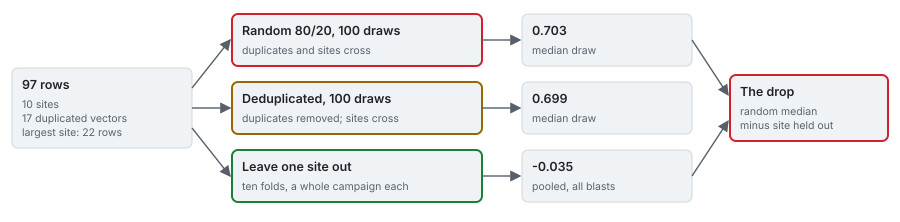

# Protocols

How every number in this product is measured: the metric, the three ways the same rows are split,
the controls, the intervals, the criterion the learned tier is judged by, and the two row sets every
grouped score is reported on.

| | Page | What it defines |
|---|---|---|
| 1 | [Metrics](protocols/01_metrics.md) | variance explained about the identity line, the squared correlation, RMSE, MAPE, abstentions |
| 2 | [Three protocols and two controls](protocols/02_three-protocols.md) | random 80/20, deduplicated, leave one site out; the null and the oracle |
| 3 | [Site-resampled intervals](protocols/03_intervals.md) | the cluster bootstrap over campaigns, and what ten sites can separate |
| 4 | [The criterion and the two row sets](protocols/04_criterion-and-row-sets.md) | the kill criterion and its history, the supports, the null's correlation, the provenance flags |

The numbers these definitions produce are in [results](results.md); the engine's implementation is in
[blastfrag docs/methods/05_protocol-sensitivity.md](https://github.com/fsantibanezleal/CAOS_BlastFrag/blob/main/docs/methods/05_protocol-sensitivity.md).
