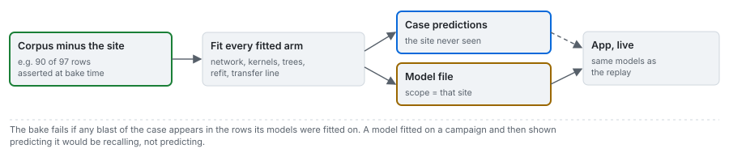
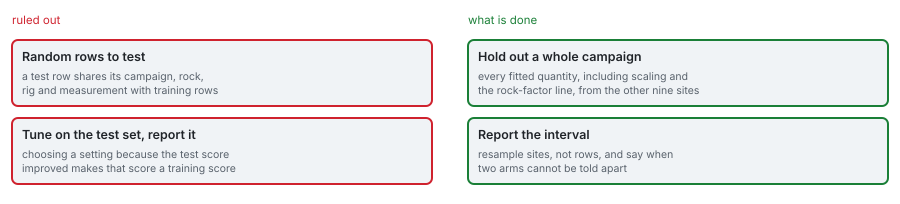

# Three protocols and two controls

The same arms on the same 97 rows, split three ways, with two controls that measure the protocol
rather than the blast.

---

## 1. Why the protocol is the experiment

Rows within one campaign share a rock mass, a drilling rig, an explosive supply and a measurement
method chosen by the people who ran that campaign (Wipfrag image analysis at the two Istanbul quarries,
image analysis at Soma, and methods the source does not restate for the other sites). One quarry,
Akdaglar, supplies 22 of the 97 rows, and 17 rows duplicate another row's input vector. A random split
therefore places rows of the same campaign, and sometimes the same input vector, on both sides, and a
model can score well by recognising the campaign rather than by modelling the blast. Roberts et al.
(2017) set out why data with group structure needs a split that holds out whole groups; Kapoor and
Narayanan (2023) catalogue how leakage between training and test rows inflates reported performance.

| Protocol | Rule | Question it answers |
|---|---|---|
| `random-8020` | seeded random 80/20, repeated for seeds 0 to 99 | how does the published protocol behave, draw to draw? |
| `dedup-random` | duplicate input vectors collapsed to one row (mean measured size), then random 80/20, repeated | how much of the random score is the duplicates? |
| `leave-one-site-out` | each of the ten campaigns held out once, out-of-fold predictions pooled | can a model reach a mine it has not seen? |

## 2. Repeated random draws

Each of the $K = 100$ draws is scored on its own test rows, and the protocol is summarised by the
median and the 5th and 95th percentiles of $\{R^2_{\mathrm{id},k}\}_{k=1}^{K}$. The draws are never
pooled, because a row lands in several test sets. A published figure from one random split is placed
among the draws by the share of draws below it ([results/03](../results/03_protocol-sensitivity.md)).

## 3. Leave one site out, pooled

Each blast is predicted once, by an arm fitted on the other nine sites, and the pooled out-of-fold
predictions are scored together:

$$
R^2_{\mathrm{LOSO}} = 1 - \frac{\sum_{i} \left(y_i - \hat y_i^{(-s(i))}\right)^2}{\sum_i (y_i - \bar y)^2}
$$

where $\hat y_i^{(-s(i))}$ is the prediction of a model fitted without the site $s(i)$ of blast $i$.
Averaging per-fold scores instead would weight the six-blast sites like the 22-blast quarry, and a
per-fold $R^2$ on six rows of one campaign mostly measures how little that campaign varies.

**Everything fitted is fitted on the training rows of the fold**: the input standardisation, the
weights, the trees, the meta-learner and the transfer rock-factor line. What cannot be refitted (the
router and the published coefficients, which the source fitted on all 97 rows; the site factor
recovered from published predictions) is flagged in the artifact's provenance and reported as such
([protocols/04](04_criterion-and-row-sets.md)).

The same rule governs the App: every learned model shown on a real campaign was fitted on the corpus
without that campaign. The bake asserts it for every case:

$$
\mathcal{T}_c = \mathcal{C} \setminus \{\,i : s(i) = s_c\,\},\qquad \forall\, i \in c:\ i \notin \mathcal{T}_c
$$

## 4. The two controls

**The null** predicts the mean measured size of the training rows of each split. It is the reference
every score is read against: a positive $R^2_{\mathrm{id}}$ beats it on the scored rows' own mean, a
margin over the null beats it on the training mean. Under leave one site out the null has a property
that matters for the criterion: holding out a coarse site lowers the training mean, so the null
predicts low exactly where the measurement is high, and its predictions correlate negatively with the
measurements (see [protocols/04](04_criterion-and-row-sets.md)).

**The oracle** returns the measurement. It must score exactly 1 under every protocol and on every row
set; anything else means the scoring code, not a model, is wrong. The engine's tests assert it under
every protocol of the benchmark. The App has its own positive control, the `ctrl-oracle` case, whose
blasts carry a measurement set to the formula's own output, so a correctly implemented arm must
reproduce it ([cases/02](../cases/02_the-controls.md)).

## 5. What the protocols rule out, and what is done instead

Random splits are still run, a hundred times each, so the size of the difference between protocols is
measured rather than argued. No hyperparameter in this product was tuned on any test score; every arm
uses its source's published settings.

## Sources

- Roberts, D. R. et al. (2017). Cross-validation strategies for data with temporal, spatial, hierarchical, or phylogenetic structure. *Ecography* 40:913-929. [doi:10.1111/ecog.02881](https://doi.org/10.1111/ecog.02881)
- Kapoor, S. and Narayanan, A. (2023). Leakage and the reproducibility crisis in machine-learning-based science. *Patterns* 4:100804. [doi:10.1016/j.patter.2023.100804](https://doi.org/10.1016/j.patter.2023.100804)
- Sui, Y. et al. (2025). *Applied Sciences* 15:1254. [doi:10.3390/app15031254](https://doi.org/10.3390/app15031254)
